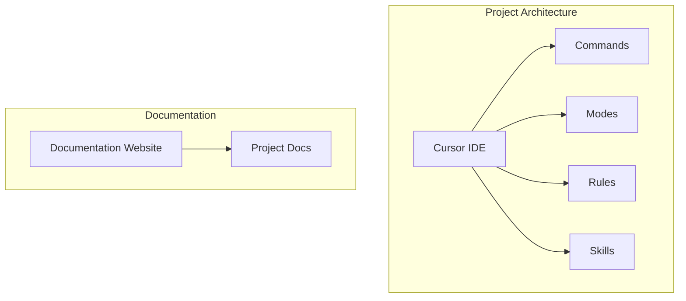
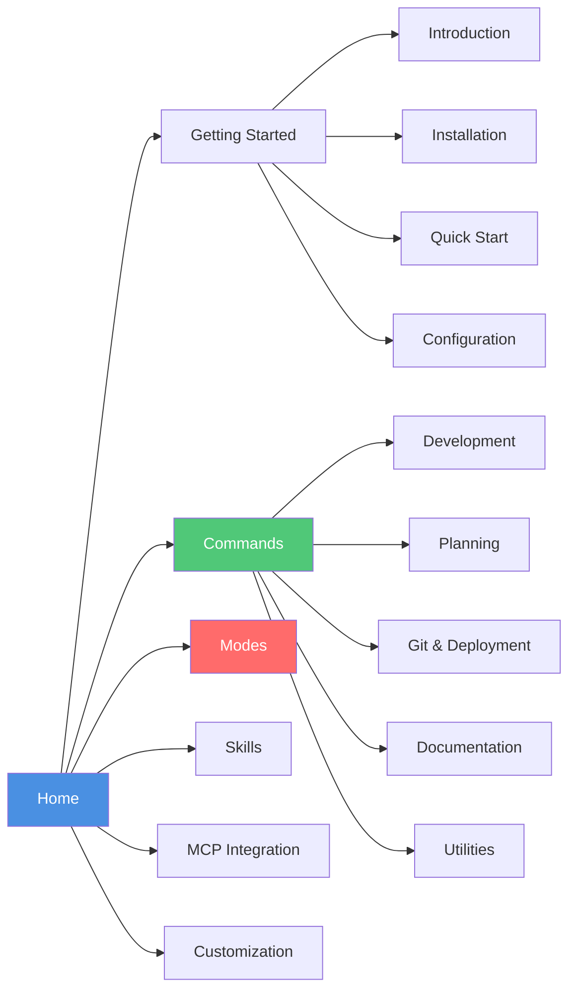

## Purpose

Generate a comprehensive onboarding guide for new team members, covering project overview, business logic, screens/UI, API endpoints, constraints, rules, and conventions.

## Usage

```
/onboarding [focus area | 'full']
```

## Arguments

- `$ARGUMENTS`:
  - `full` or omitted: Generate complete onboarding guide
  - `business`: Focus on business logic and domain
  - `ui`: Focus on screens and UI components
  - `api`: Focus on API endpoints
  - `conventions`: Focus on code conventions and rules
  - `architecture`: Focus on architecture and tech stack

---

Generate onboarding guide for new team member: **$ARGUMENTS**

## Workflow

### Phase 1: Project Overview

1. **Read Project Documentation**
   - README.md
   - Project context files (.cursorrules, CLAUDE.md)
   - Architecture documents
   - Design documents (if available)

2. **Extract Project Information**
   - Project name and purpose
   - Tech stack (languages, frameworks, databases)
   - Architecture pattern (monolith, microservices, serverless, etc.)
   - Deployment and hosting
   - Team size and structure

3. **Identify Key Directories**
   - Source code structure
   - Configuration files
   - Documentation location
   - Test files location

### Phase 2: Business Logic Analysis

1. **Scan Business Logic Files**
   - Services directory (business logic layer)
   - Models directory (domain models)
   - Utils directory (business utilities)
   - Find core business rules

2. **Identify Business Domains**
   - Main features/modules
   - Core entities and their relationships
   - Business workflows
   - Key business rules and constraints

3. **Document Business Logic**
   - List all business domains
   - Explain each domain's purpose
   - Document key business rules
   - Note important workflows

### Phase 3: UI/Screens Analysis

1. **Scan Frontend Structure**
   - Pages/routes structure
   - Components organization
   - UI library used (if any)
   - Styling approach (CSS, Tailwind, etc.)
   - **Read website configuration** (e.g., `astro.config.mjs`, `next.config.js`)
   - **Identify routing structure** from config files

2. **Identify Screens/Pages**
   - List all main screens
   - Document screen purposes
   - Note navigation flow
   - Identify key UI components
   - **Create sitemap** showing complete route hierarchy
   - **Map navigation relationships** between pages

3. **Document UI Patterns**
   - Component structure patterns
   - Styling conventions
   - State management approach
   - Form handling patterns
   - **Create navigation flow diagram** (Mermaid)
   - **Document complete sitemap** with all routes

### Phase 4: API Endpoints Analysis

1. **Scan API Routes**
   - API route files
   - Endpoint definitions
   - Request/response structures
   - Authentication/authorization

2. **Document API Endpoints**
   - List all endpoints by resource
   - Document HTTP methods and paths
   - Request/response formats
   - Authentication requirements
   - Error handling

3. **API Patterns**
   - API structure patterns
   - Error response format
   - Pagination approach
   - Filtering and sorting

### Phase 5: Constraints and Rules

1. **Read Configuration Files**
   - Environment variables
   - Configuration files
   - Validation rules
   - Security constraints

2. **Identify Constraints**
   - Business constraints
   - Technical constraints
   - Security constraints
   - Performance constraints
   - Data constraints

3. **Document Rules**
   - Business rules
   - Validation rules
   - Security rules
   - Data rules

### Phase 6: Code Conventions

1. **Read Code Convention Files**
   - .cursorrules or CLAUDE.md
   - Code style guides
   - Linting configurations
   - Type definitions

2. **Extract Conventions**
   - **Naming Conventions**
     * Files, functions, classes, variables
     * Constants and enums
     * Components and modules
   
   - **Code Style**
     * Language-specific style (PEP 8, ESLint, etc.)
     * Formatting rules
     * Type hints/annotations
     * Documentation style
   
   - **File Organization**
     * Directory structure
     * File naming patterns
     * Import/export conventions
     * Test file organization
   
   - **Architecture Patterns**
     * Design patterns used
     * Architectural decisions
     * Layer separation
     * Dependency management

3. **Learn from Existing Code**
   - Read 3-5 representative files
   - Analyze code style patterns
   - Extract conventions being followed
   - Document patterns to follow

### Phase 7: Generate Onboarding Document

1. **Create Comprehensive Guide**
   - Structure document with all sections
   - Include examples from codebase
   - Add links to key files
   - Include quick reference tables
   - **Add Mermaid diagrams** for:
     * Architecture overview
     * System component relationships
     * Command workflow flows
     * Navigation flow (for frontend)
   - **Include Frontend Sitemap**:
     * Complete website structure
     * Route hierarchy
     * Page organization
     * Navigation relationships

2. **Save Document**
   - **Reference**: `.cursor/rules/output-paths.mdc`
   - Default path: `docs/01-onboarding/onboarding-guide.md`
   - Ensure directory exists (create if needed)
   - Save comprehensive guide

## Output Format

```markdown
# Onboarding Guide: [Project Name]

**Generated**: [Date]
**For**: New Team Members

---

## Table of Contents

1. [Project Overview](#project-overview)
2. [Business Logic](#business-logic)
3. [UI/Screens](#uiscreens)
4. [API Endpoints](#api-endpoints)
5. [Constraints & Rules](#constraints--rules)
6. [Code Conventions](#code-conventions)
7. [Getting Started](#getting-started)
8. [Quick Reference](#quick-reference)

---

## Project Overview

### Project Purpose
[Brief description of what the project does]

### Tech Stack

| Category | Technology |
|----------|-----------|
| Frontend | [Framework/Library] |
| Backend | [Framework/Language] |
| Database | [Database] |
| Authentication | [Auth method] |
| Hosting | [Hosting platform] |
| Testing | [Testing tools] |

### Architecture

[Architecture diagram or description]

**Include Mermaid Diagrams:**



```
[Architecture overview]
```

### Project Structure

```
[Directory tree of key folders]
```

### Key Directories

| Directory | Purpose |
|-----------|---------|
| `src/api/` | API endpoints |
| `src/services/` | Business logic |
| `src/models/` | Data models |
| `src/components/` | UI components |
| `tests/` | Test files |

---

## Business Logic

### Core Business Domains

#### Domain 1: [Domain Name]
- **Purpose**: [What this domain handles]
- **Key Entities**: [Main entities]
- **Location**: `src/services/[domain]/`

**Key Business Rules:**
- [Rule 1]
- [Rule 2]

**Workflows:**
- [Workflow 1 description]
- [Workflow 2 description]

#### Domain 2: [Domain Name]
[...]

### Business Rules Summary

| Rule | Domain | Constraint |
|------|--------|------------|
| [Rule] | [Domain] | [Constraint] |

### Key Business Files

- `src/services/[service].ts` - [Description]
- `src/models/[model].ts` - [Description]

---

## UI/Screens

### Main Screens

#### Screen 1: [Screen Name]
- **Route**: `/path/to/screen`
- **Purpose**: [What this screen does]
- **Key Components**: [List components]
- **File**: `app/[path]/page.tsx` or `pages/[path].tsx`

**Features:**
- [Feature 1]
- [Feature 2]

#### Screen 2: [Screen Name]
[...]

### Navigation Flow

**Include Mermaid Diagram:**



```
[Home] → [Screen 1] → [Screen 2]
         ↓
      [Screen 3]
```

### Frontend Sitemap

**Document the complete website structure:**

```mermaid
graph TD
    ROOT[/] --> GS[Getting Started]
    ROOT --> CMD[Commands]
    ROOT --> MCP[MCP Integrations]
    ROOT --> MODE[Modes]
    ROOT --> SKILL[Skills]
    ROOT --> CUST[Customization]
    
    GS --> GS1[Introduction]
    GS --> GS2[Installation]
    GS --> GS3[Quick Start]
    GS --> GS4[Configuration]
    
    CMD --> CMD_OV[Overview]
    CMD --> CMD_DEV[Development]
    CMD --> CMD_PLAN[Planning]
    CMD --> CMD_GIT[Git & Deployment]
    CMD --> CMD_DOC[Documentation]
    CMD --> CMD_UTIL[Utilities]
    
    CMD_DEV --> CMD_FEAT[/feature]
    CMD_DEV --> CMD_FIX[/fix]
    CMD_DEV --> CMD_REV[/review]
    CMD_DEV --> CMD_TEST[/test]
    CMD_DEV --> CMD_REF[/refactor]
    CMD_DEV --> CMD_DEBUG[/debug]
    CMD_DEV --> CMD_TDD[/tdd]
    
    CMD_PLAN --> CMD_PLAN1[/plan]
    CMD_PLAN --> CMD_BRAIN[/brainstorm]
    CMD_PLAN --> CMD_EXEC[/execute-plan]
    CMD_PLAN --> CMD_RESEARCH[/research]
    
    CMD_GIT --> CMD_SHIP[/ship]
    CMD_GIT --> CMD_COMMIT[/commit]
    CMD_GIT --> CMD_PR[/pr]
    CMD_GIT --> CMD_DEPLOY[/deploy]
    CMD_GIT --> CMD_CHANGELOG[/changelog]
    
    CMD_DOC --> CMD_DOC1[/doc]
    CMD_DOC --> CMD_API[/api-gen]
    
    CMD_UTIL --> CMD_MODE[/mode]
    CMD_UTIL --> CMD_INDEX[/index]
    CMD_UTIL --> CMD_LOAD[/load]
    CMD_UTIL --> CMD_CHECK[/checkpoint]
    CMD_UTIL --> CMD_SPAWN[/spawn]
    CMD_UTIL --> CMD_STATUS[/status]
    CMD_UTIL --> CMD_HELP[/help]
    CMD_UTIL --> CMD_OPT[/optimize]
    CMD_UTIL --> CMD_SEC[/security-scan]
    
    MCP --> MCP_OV[Overview]
    MCP --> MCP_CTX7[Context7]
    MCP --> MCP_SEQ[Sequential Thinking]
    MCP --> MCP_PLAY[Playwright]
    MCP --> MCP_MEM[Memory]
    MCP --> MCP_FS[Filesystem]
    MCP --> MCP_INT[Integration]
    
    MODE --> MODE_OV[Overview]
    MODE --> MODE_DEF[Default]
    MODE --> MODE_BRAIN[Brainstorm]
    MODE --> MODE_TOKEN[Token-Efficient]
    MODE --> MODE_RESEARCH[Deep Research]
    MODE --> MODE_IMPL[Implementation]
    MODE --> MODE_REV[Review]
    MODE --> MODE_ORCH[Orchestration]
    
    SKILL --> SKILL_OV[Overview]
    SKILL --> SKILL_METHOD[Methodology]
    SKILL --> SKILL_LANG[Languages]
    SKILL --> SKILL_FRAMEWORK[Frameworks]
    
    SKILL_METHOD --> SKILL_BRAIN[Brainstorming]
    SKILL_METHOD --> SKILL_PLAN[Writing Plans]
    SKILL_METHOD --> SKILL_EXEC[Executing Plans]
    SKILL_METHOD --> SKILL_TDD[TDD]
    SKILL_METHOD --> SKILL_DEBUG[Systematic Debugging]
    SKILL_METHOD --> SKILL_REV[Code Review]
    
    SKILL_LANG --> SKILL_PY[Python]
    SKILL_LANG --> SKILL_TS[TypeScript]
    SKILL_LANG --> SKILL_JS[JavaScript]
    
    SKILL_FRAMEWORK --> SKILL_REACT[React]
    SKILL_FRAMEWORK --> SKILL_NEXT[Next.js]
    SKILL_FRAMEWORK --> SKILL_FAST[FastAPI]
    SKILL_FRAMEWORK --> SKILL_DJANGO[Django]
    
    CUST --> CUST_OV[Overview]
    CUST --> CUST_CMD[Creating Commands]
    CUST --> CUST_MODE[Creating Modes]
    CUST --> CUST_SKILL[Creating Skills]
    CUST --> CUST_CLAUDE[CLAUDE.md Reference]
    
    style ROOT fill:#4A90E2,color:#fff
    style CMD fill:#50C878,color:#fff
    style MODE fill:#FF6B6B,color:#fff
    style SKILL fill:#9B59B6,color:#fff
    style MCP fill:#FF8C42,color:#fff
```

**Sitemap Structure:**

| Section | Route | Pages | Description |
|---------|-------|-------|-------------|
| **Getting Started** | `/getting-started/` | 4 | Introduction, Installation, Quick Start, Configuration |
| **Commands** | `/commands/` | 27+ | All slash commands organized by category |
| **MCP Integrations** | `/mcp/` | 7 | MCP server documentation |
| **Modes** | `/modes/` | 8 | Behavioral modes documentation |
| **Skills** | `/skills/` | 30+ | Framework/language/methodology skills |
| **Customization** | `/customization/` | 5 | Guides for customizing the kit |

### UI Components

| Component | Location | Purpose |
|-----------|----------|---------|
| [Component] | `components/[path]` | [Purpose] |

### UI Patterns

- **Styling**: [CSS framework/library]
- **State Management**: [State management approach]
- **Form Handling**: [Form library/pattern]
- **Component Library**: [UI library if any]

---

## API Endpoints

### Authentication

| Method | Endpoint | Purpose | Auth Required |
|--------|----------|---------|---------------|
| POST | `/api/auth/login` | User login | No |
| POST | `/api/auth/logout` | User logout | Yes |
| POST | `/api/auth/refresh` | Refresh token | Yes |

### [Resource 1]

| Method | Endpoint | Purpose | Auth Required |
|--------|----------|---------|---------------|
| GET | `/api/[resource]` | List all | Yes |
| GET | `/api/[resource]/:id` | Get one | Yes |
| POST | `/api/[resource]` | Create | Yes |
| PUT | `/api/[resource]/:id` | Update | Yes |
| DELETE | `/api/[resource]/:id` | Delete | Yes |

### [Resource 2]
[...]

### API Patterns

**Request Format:**
```typescript
// Example request
```

**Response Format:**
```typescript
// Example response
```

**Error Format:**
```typescript
// Example error response
```

**Pagination:**
```typescript
// Pagination approach
```

---

## Constraints & Rules

### Business Constraints

- [Constraint 1]: [Description]
- [Constraint 2]: [Description]

### Technical Constraints

- [Constraint 1]: [Description]
- [Constraint 2]: [Description]

### Security Constraints

- [Constraint 1]: [Description]
- [Constraint 2]: [Description]

### Data Constraints

- [Constraint 1]: [Description]
- [Constraint 2]: [Description]

### Validation Rules

| Field | Rule | Message |
|-------|------|---------|
| [Field] | [Rule] | [Error message] |

---

## Code Conventions

### Naming Conventions

| Type | Convention | Example |
|------|------------|---------|
| Files | [Convention] | `example-file.ts` |
| Functions | [Convention] | `exampleFunction()` |
| Classes | [Convention] | `ExampleClass` |
| Variables | [Convention] | `exampleVariable` |
| Constants | [Convention] | `EXAMPLE_CONSTANT` |

### Code Style

**Language-Specific:**
- [Language]: [Style guide] (e.g., PEP 8, ESLint)
- Formatting: [Tool] (e.g., Prettier, Black)
- Type hints: [Required/Optional]

**Documentation:**
- Docstrings: [Style] (e.g., Google style, JSDoc)
- Comments: [When to use]

### File Organization

**Structure:**
```
[Directory structure pattern]
```

**Patterns:**
- One component/class per file
- Group related files in feature directories
- Test files: [Location pattern]

### Architecture Patterns

**Design Patterns Used:**
- [Pattern 1]: [Where used]
- [Pattern 2]: [Where used]

**Architectural Decisions:**
- [Decision 1]: [Rationale]
- [Decision 2]: [Rationale]

### Example Code

```typescript
// Example showing conventions
// [Explanation of conventions shown]
```

---

## Getting Started

### Prerequisites

- [Requirement 1]
- [Requirement 2]

### Setup Steps

1. **Clone Repository**
   ```bash
   git clone [repo-url]
   cd [project-name]
   ```

2. **Install Dependencies**
   ```bash
   npm install
   # or
   pip install -r requirements.txt
   ```

3. **Configure Environment**
   ```bash
   cp .env.example .env
   # Edit .env with your values
   ```

4. **Run Development Server**
   ```bash
   npm run dev
   # or
   python manage.py runserver
   ```

5. **Run Tests**
   ```bash
   npm test
   # or
   pytest
   ```

### First Tasks

1. [Task 1 for new member]
2. [Task 2 for new member]
3. [Task 3 for new member]

### Key Files to Read

- `README.md` - Project overview
- `docs/[architecture].md` - Architecture details
- `src/services/[core-service].ts` - Core business logic example
- `src/api/[core-endpoint].ts` - API endpoint example

---

## Quick Reference

### Common Commands

| Command | Purpose |
|---------|---------|
| `npm run dev` | Start dev server |
| `npm test` | Run tests |
| `npm run build` | Build for production |
| `npm run lint` | Run linter |

### Key Concepts

| Concept | Description | Location |
|---------|-------------|----------|
| [Concept] | [Description] | [File/Path] |

### Important Links

- Documentation: [Link]
- API Docs: [Link]
- Design System: [Link]
- Project Board: [Link]

---

## Next Steps

1. Read this guide thoroughly
2. Set up development environment
3. Explore codebase using `/index` command
4. Read key files mentioned above
5. Start with small tasks
6. Ask questions in team chat

**Questions?** Contact [Team Lead/Mentor]
```

## Flags

| Flag | Description | Example |
|------|-------------|---------|
| `--focus=[area]` | Focus on specific area | `--focus=business` |
| `--depth=[1-5]` | Detail level (1=quick, 5=exhaustive) | `--depth=5` |
| `--format=[fmt]` | Output format (concise/detailed) | `--format=detailed` |
| `--save=[path]` | Save guide to file | `--save=docs/01-onboarding/guide.md` |

### Focus Areas

| Focus | Description |
|-------|-------------|
| `full` | Complete guide (default) |
| `business` | Business logic and domain |
| `ui` | Screens and UI components |
| `api` | API endpoints |
| `conventions` | Code conventions and rules |
| `architecture` | Architecture and tech stack |

### Flag Usage Examples

```bash
/onboarding                    # Full guide
/onboarding --focus=business    # Business logic only
/onboarding --focus=api        # API endpoints only
/onboarding --depth=5          # Exhaustive detail
/onboarding --save=docs/01-onboarding/new-member-guide.md
```

## MCP Integration

This command leverages MCP servers for comprehensive analysis:

### Filesystem - Project Scanning (Primary)
```
ALWAYS use Filesystem for project scanning:
- Use directory_tree to understand project structure
- Use list_directory to explore directories
- Use search_files to find specific patterns
- Use read_file to analyze key files
- Use get_file_info to find latest/modified files
```

### Context7 - Technology Documentation
```
When analyzing tech stack:
- Use Context7 to fetch current documentation
- Understand framework patterns
- Get best practices for technologies used
```

### Memory - Project Knowledge
```
Store onboarding information:
- Create entities for key concepts
- Store relationships between components
- Remember patterns and conventions
- Build knowledge graph for future reference
```

### Sequential Thinking - Structured Analysis
```
For complex analysis:
- Break down analysis into logical steps
- Track findings systematically
- Build comprehensive understanding incrementally
```

## When to Use

- When new team member joins
- When onboarding documentation is outdated
- When project structure changes significantly
- When preparing for knowledge transfer
- When creating project documentation

## Related Commands

- `/index` - Generate project structure index
- `/doc` - Generate documentation
- `/load` - Load specific components into context
- `/review` - Review code for understanding

## Tips for New Members

1. **Start with Overview**: Read project overview first
2. **Explore Codebase**: Use `/index` to understand structure
3. **Read Key Files**: Focus on core business logic files
4. **Follow Conventions**: Study code conventions carefully
5. **Ask Questions**: Don't hesitate to ask team members
6. **Start Small**: Begin with small tasks to learn gradually

