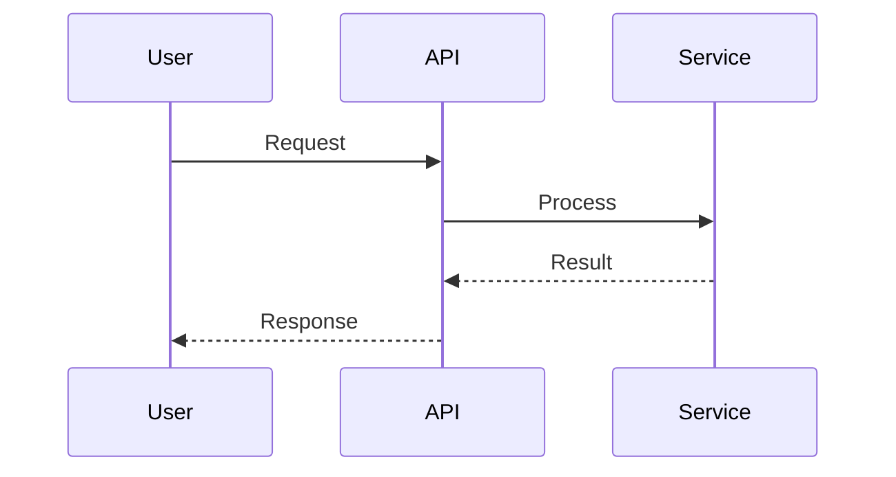
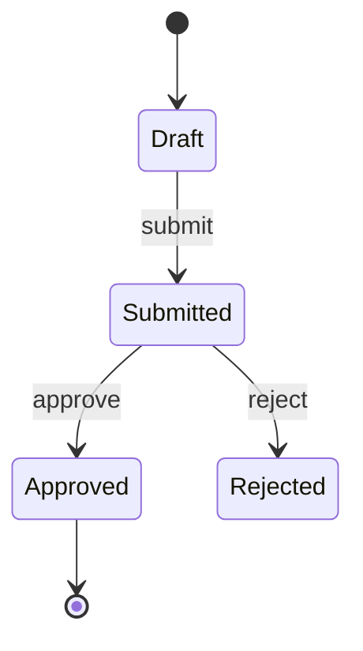
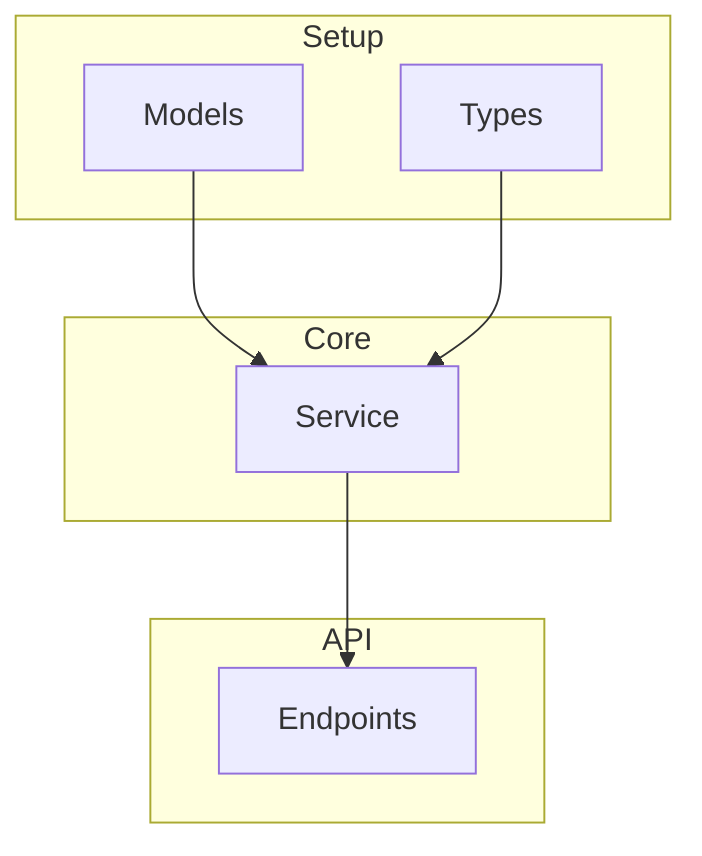
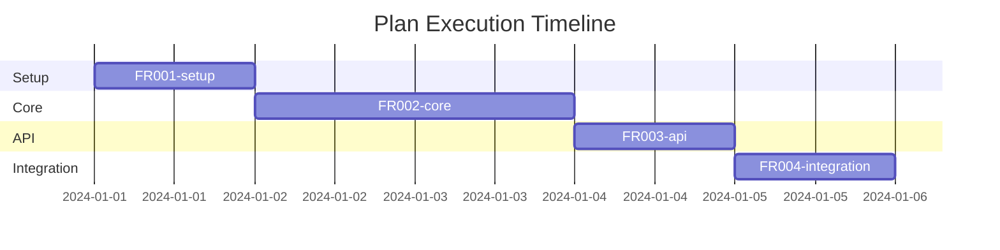

/# /plan - Task Planning Command

## Purpose

Create structured implementation plans with task breakdown, dependencies, and time estimates for complex work.

## Usage

```
/plan [task description or feature request]
```

## Arguments

- `$ARGUMENTS`: Description of the task, feature, or work to plan

---

Create a detailed implementation plan for: **$ARGUMENTS**

## Workflow

### Phase 1: Understanding

1. **Parse Requirements**
   - Identify core functionality needed
   - List explicit requirements
   - Note implicit requirements
   - Identify acceptance criteria

2. **Clarify Ambiguities**
   - Ask questions if unclear
   - List assumptions made
   - Note dependencies on decisions

### Phase 2: Research

1. **Explore Codebase**
   - Find related implementations
   - Identify patterns to follow
   - Locate integration points
   - Note conventions

2. **Study Existing Code Style**
   - **Read Similar Implementations**
     - Read 3-5 similar implementations in codebase
     - Focus on files that solve similar problems
     - Note architectural patterns used
   - **Analyze Code Style and Patterns**
     - Naming conventions (variables, functions, classes, files)
     - Code structure patterns (how code is organized)
     - Error handling approaches
     - Testing patterns and conventions
     - Documentation style
   - **Extract Conventions**
     - File organization patterns
     - Import/export patterns
     - Type definitions and interfaces
     - Configuration and setup patterns
   - **Document Style Guide for Implementation**
     - List specific patterns to follow
     - Note architectural decisions to replicate
     - Identify conventions to maintain consistency
     - Document any patterns to avoid

3. **Technical Research** (if needed)
   - Research unfamiliar technologies
   - Find best practices
   - Identify potential pitfalls

### Phase 3: Task Breakdown

1. **Decompose Work**
   - Break into atomic tasks
   - Each task: 15-60 minutes
   - Clear completion criteria

2. **Order by Dependencies**
   - What blocks what
   - Parallel opportunities
   - Critical path

3. **Add Estimates**
   - S: <30 min
   - M: 30-60 min
   - L: 1-2 hours
   - XL: 2-4 hours

### Phase 4: Documentation

1. **Create Plan Document**
   - Summary
   - Task list
   - Files to modify
   - Risks
   - **Include Mermaid diagrams when they clarify**:
     - **Sequence diagram**: Request/response flows, auth flows, multi-step processes
     - **State diagram**: Entity lifecycles (order, user, session), status transitions
     - **Architecture diagram**: System/component structure, layer boundaries
     - **Gantt chart**: Phases, parallel workstreams, execution timeline (especially for split plans)

   **Mermaid Diagram Reference** (use when they clarify plans):
   - **Sequence diagram**: Request/response, auth, multi-step flows between components
   - **State diagram**: Entity lifecycles (order, user, session), status transitions
   - **Architecture (flowchart)**: Layers, components, data flow (Setup → Core → API → Integration)
   - **Gantt chart**: Sub-plan timeline, phase duration, dependencies (for split plans)

2. **Determine if Plan Should Be Split**

   **Split Criteria** (any of the following):
   - Plan has **15+ tasks** (standard mode) or **30+ tasks** (detailed mode)
   - Plan spans **3+ major phases** (Setup, Core, API, Integration, etc.)
   - Plan involves **multiple independent components** that can be developed separately
   - User explicitly requests splitting with `--split` flag

   **If split is needed**:

   **Step 1: Identify Logical Boundaries**
   - Group tasks by natural boundaries:
     - **By Phase**: Setup → Core → API → Integration
     - **By Component**: Data Layer → Service Layer → API Layer → Frontend
     - **By Feature**: Auth → Payment → Notification
   - Each group should be:
     - **Cohesive**: Tasks in group work together toward one goal
     - **Independent**: Can be executed as a unit
     - **Sequential**: Clear order (later groups depend on earlier)

   **Step 2: Maintain Continuity**

   **Code Continuity**:
   - Document shared files/modules created in earlier sub-plans
   - List imports/dependencies that later sub-plans will need
   - Ensure naming conventions are consistent across sub-plans
   - Track which files are created vs modified in each sub-plan

   **Data Continuity**:
   - Document data models created in Setup sub-plan
   - Track how data flows: Setup → Core → API → Integration
   - Note database schema changes and migrations
   - Document shared data structures (types, interfaces, DTOs)

   **Integration Continuity**:
   - Document integration points between sub-plans
   - List APIs/services that one sub-plan exposes for the next
   - Track configuration that needs to be shared
   - Note testing contracts (what tests verify what)

   **Logic Flow Continuity**:
   - Ensure business logic flows correctly across sub-plans
   - Document how validation rules propagate (Setup → Core → API)
   - Track error handling patterns across layers
   - Maintain consistent architectural patterns

   **Step 3: Detect Design Reference**
   - **Check for Design Code**: Look for references to Design documents in:
     - Plan description or context (mentions "Design DS001", "from DS001", etc.)
     - Related design files in `docs/03-design/` directory
     - User input that references a Design code (e.g., "implement from DS001")
   - **Design Code Detection**:
     - Pattern: `DS[0-9]{3}` (e.g., DS001, DS002, DS123)
     - If found: Use Design code for folder name (e.g., `docs/04-docs/04-plans/DS001/`)
     - If not found: Use plan prefix (e.g., `FR001`, `FR002`)
   - **Design Code Priority**: If Design code exists, use it; otherwise use plan prefix
   - **Folder Naming**: Folder name matches Design code to maintain consistency with design documents

   **Step 4: Create Sub-Plan Structure**
   - Each sub-plan should:
     - Have sequential number: `01-[phase-name].md`, `02-[phase-name].md`, `03-[phase-name].md`, etc.
     - Numbers indicate execution order (01 = first, 02 = second, etc.)
     - List its dependencies (which sub-plans must complete first)
     - Document what it delivers (for next sub-plans to use)
     - Include integration notes (how it connects to previous/next)
     - Be independently executable with `/execute-plan`

   **Step 5: Create Index Plan**
   - Overview of entire feature
   - Table of all sub-plans with execution order (numbered 01, 02, 03, etc.)
   - Shared context section (models, types, configs)
   - Integration points map
   - Data flow diagram (use Mermaid: sequence or flowchart when helpful)
   - Logic flow explanation
   - **Gantt chart** (Mermaid) when split into phases—show sub-plan timeline and dependencies
   - **Architecture/flowchart** when layers or components need a visual

3. **Save Plan (if --save flag provided)**
   - **Reference**: `.cursor/rules/output-paths.mdc`
   - Extract directory from save path (e.g., `docs/04-docs/04-plans/auth.md` → `docs/04-docs/04-plans/`)
   - Ensure directory exists (create if needed)

   **If plan is split**:
   - **Detect Design Code**: Check if plan references a Design document (e.g., `DS001`, `DS002`)
     - If Design code found: Use Design code for folder name (e.g., `docs/04-docs/04-plans/DS001/`)
     - If no Design code: Generate plan prefix and number (e.g., `FR001`)
   - **Create sub-folder**: `docs/04-docs/04-plans/[DESIGN_CODE_OR_PREFIX]/` (e.g., `docs/04-docs/04-plans/DS001/` or `docs/04-docs/04-plans/FR001/`)
   - **Create index plan**: `docs/04-docs/04-plans/[DESIGN_CODE_OR_PREFIX]/index.md` (overview with all sub-plans)
   - **Create sub-plans with unique FR numbers**:
     - Each sub-plan gets its own FR number (FR001, FR002, FR003, etc.)
     - Format: `docs/04-docs/04-plans/[DESIGN_CODE_OR_PREFIX]/FR[NUMBER]-[phase-name].md`
     - Example: `docs/04-docs/04-plans/DS001/FR001-setup.md`, `docs/04-docs/04-plans/DS001/FR002-core.md`, `docs/04-docs/04-plans/DS001/FR003-api.md`
     - **FR Number Assignment**:
       - Start with FR001 for first sub-plan
       - Increment for each subsequent sub-plan (FR002, FR003, FR004, ...)
       - Check existing FR numbers in folder to avoid duplicates
       - Each sub-plan has unique FR number for independent tracking
   - Each sub-plan is independently executable with `/execute-plan`
   - **Format ensures**:
     - Folder name matches Design code (DS001) if Design is referenced
     - Each sub-plan has unique FR number (FR001, FR002, FR003, ...)
     - Execution order is maintained through dependencies, not filename numbering

   **If plan is NOT split**:
   - Save plan to specified path (standard behavior)

4. **Track with TodoWrite**
   - Add all tasks (or sub-plan references if split)
   - Set initial status

## Output

### Single Plan (Small/Medium Complexity)

When plan has <15 tasks (standard) or <30 tasks (detailed):

```markdown
## Plan: [Feature/Task Name]

### Summary

[2-3 sentence overview of what will be built]

### Scope

**In Scope**

- [What will be done]

**Out of Scope**

- [What won't be done]

**Assumptions**

- [Key assumptions made]

---

### Tasks

#### Phase 1: Setup [Total: Xh]

| #   | Task                      | Size | Depends On |
| --- | ------------------------- | ---- | ---------- |
| 1   | Create data model         | M    | -          |
| 2   | Set up database migration | S    | 1          |
| 3   | Add model tests           | M    | 1          |

#### Phase 2: Core Implementation [Total: Xh]

| #   | Task                    | Size | Depends On |
| --- | ----------------------- | ---- | ---------- |
| 4   | Implement service layer | L    | 1          |
| 5   | Add business logic      | M    | 4          |
| 6   | Write service tests     | M    | 5          |

#### Phase 3: API Layer [Total: Xh]

| #   | Task                 | Size | Depends On |
| --- | -------------------- | ---- | ---------- |
| 7   | Create API endpoints | M    | 5          |
| 8   | Add validation       | S    | 7          |
| 9   | Write API tests      | M    | 8          |

#### Phase 4: Integration [Total: Xh]

| #   | Task                    | Size | Depends On |
| --- | ----------------------- | ---- | ---------- |
| 10  | Integrate with frontend | M    | 7          |
| 11  | End-to-end testing      | M    | 10         |
| 12  | Update documentation    | S    | 11         |

---

### Files to Create/Modify

**Create**

- `src/models/feature.py` - Data model
- `src/services/feature.py` - Business logic
- `src/api/feature.py` - API endpoints
- `tests/test_feature.py` - Tests

**Modify**

- `src/api/__init__.py` - Register routes
- `docs/api.md` - API documentation

---

### Dependencies

**External**

- [Package X] - For [purpose]

**Internal**

- Requires [existing feature] to be complete

---

### Risks

| Risk     | Impact | Mitigation        |
| -------- | ------ | ----------------- |
| [Risk 1] | High   | [How to mitigate] |
| [Risk 2] | Medium | [How to mitigate] |

---

### Questions for Stakeholders

1. [Question about requirement]
2. [Question about edge case]

---

### Success Criteria

- [ ] All tasks completed
- [ ] Tests passing with 80%+ coverage
- [ ] API documentation updated
- [ ] Code reviewed and approved
```

### Mermaid Diagram Reference (Plans)

Use Mermaid in plan docs when they clarify. Fence with ` ```mermaid ` and ` ``` `.

**Sequence diagram** — request/response or multi-step flows:



**State diagram** — entity lifecycle (order, user, session):



**Architecture (flowchart)** — layers / data flow (especially for split plans):



**Gantt chart** — sub-plan timeline (for split plans):



### Split Plan (Large/Complex Features)

When plan is split into multiple sub-plans:

**Index Plan** (`docs/04-docs/04-plans/[PREFIX][NUMBER]/index.md`):

```markdown
# Plan: [Feature/Task Name] - Overview

**Plan Code**: [PREFIX][NUMBER] (e.g., FR001, DS001)

### Summary

[2-3 sentence overview of the entire feature]

### Plan Structure

This plan has been split into [N] sub-plans for step-by-step execution:

| Sub-Plan             | Phase/Component       | Tasks    | Dependencies  | Execute With                                                             |
| -------------------- | --------------------- | -------- | ------------- | ------------------------------------------------------------------------ |
| FR001-setup.md       | Setup & Foundation    | 8 tasks  | -             | `/execute-plan docs/04-docs/04-plans/[DESIGN_CODE]/FR001-setup.md`       |
| FR002-core.md        | Core Implementation   | 12 tasks | Setup (FR001) | `/execute-plan docs/04-docs/04-plans/[DESIGN_CODE]/FR002-core.md`        |
| FR003-api.md         | API Layer             | 10 tasks | Core (FR002)  | `/execute-plan docs/04-docs/04-plans/[DESIGN_CODE]/FR003-api.md`         |
| FR004-integration.md | Integration & Testing | 6 tasks  | API (FR003)   | `/execute-plan docs/04-docs/04-plans/[DESIGN_CODE]/FR004-integration.md` |

### Execution Order

**IMPORTANT**: Execute sub-plans in order to maintain continuity:

1. **Setup** → Creates foundation (data models, configs, base structure)
2. **Core** → Implements business logic (depends on Setup)
3. **API** → Creates endpoints (depends on Core)
4. **Integration** → Connects components and tests (depends on API)

### Shared Context

**Data Models** (defined in Setup, used by all):

- `src/models/user.ts` - User entity
- `src/models/product.ts` - Product entity

**Interfaces** (defined in Setup, used by all):

- `src/types/api.ts` - API request/response types
- `src/types/service.ts` - Service layer interfaces

**Configuration** (defined in Setup, used by all):

- `src/config/database.ts` - Database connection
- `src/config/auth.ts` - Authentication config

### Integration Points

**Between Setup → Core**:

- Core uses data models from Setup
- Core imports interfaces from Setup

**Between Core → API**:

- API calls service methods from Core
- API uses types from Setup

**Between API → Integration**:

- Integration tests use API endpoints
- Integration connects frontend to API

### Data Flow Continuity
```

Setup (Data Layer)
↓ [creates models, migrations]
Core (Business Logic)
↓ [uses models, implements services]
API (Endpoints)
↓ [exposes services via HTTP]
Integration (Frontend + E2E Tests)
↓ [consumes API, validates flow]

```

### Logic Flow Continuity

Each sub-plan maintains logical flow:
- **Setup**: Establishes data structures and contracts
- **Core**: Implements business rules and validation
- **API**: Exposes functionality with proper error handling
- **Integration**: Validates end-to-end behavior

### Files Structure

```

docs/04-docs/04-plans/[DESIGN_CODE]/ (e.g., docs/04-docs/04-plans/DS001/)
├── index.md (this file - overview)
├── FR001-setup.md (first sub-plan with unique FR number)
├── FR002-core.md (second sub-plan with unique FR number)
├── FR003-api.md (third sub-plan with unique FR number)
└── FR004-integration.md (fourth sub-plan with unique FR number)

```

**Note**:
- Folder name matches Design code (e.g., `DS001`) if plan is based on a Design document, or plan prefix (e.g., `FR001`) if not
- Each sub-plan has unique FR number: `FR[NUMBER]-[phase-name].md` (e.g., `FR001-setup.md`, `FR002-core.md`)
- FR numbers increment for each sub-plan (FR001 → FR002 → FR003 → FR004)
- Execution order maintained through dependencies, not filename numbering

### Success Criteria
- [ ] All sub-plans completed in order
- [ ] Each sub-plan passes its own tests
- [ ] Integration tests pass end-to-end
- [ ] Code reviewed and approved

---

## Next Steps

1. **Start with Setup**: `/execute-plan docs/04-docs/04-plans/[DESIGN_CODE]/FR001-setup.md`
2. **Continue with Core**: `/execute-plan docs/04-docs/04-plans/[DESIGN_CODE]/FR002-core.md`
3. **Proceed to API**: `/execute-plan docs/04-docs/04-plans/[DESIGN_CODE]/FR003-api.md`
4. **Finish with Integration**: `/execute-plan docs/04-docs/04-plans/[DESIGN_CODE]/FR004-integration.md`

**Execution Order**: Execute in dependency order (FR001 → FR002 → FR003 → FR004)
**File Format**: `FR[NUMBER]-[phase-name].md` (e.g., `FR001-setup.md`, `FR002-core.md`, `FR003-api.md`)
**Note**:
- Each sub-plan has unique FR number (FR001, FR002, FR003, ...)
- Folder name matches Design code (DS001) if Design is referenced
- Filename always uses plan prefix (FR) with unique number for each sub-plan
```

**Sub-Plan Example** (`docs/04-docs/04-plans/[DESIGN_CODE]/FR001-setup.md`):

```markdown
# Plan: [Feature Name] - Setup & Foundation

**Parent Plan**: [DESIGN_CODE] (e.g., DS001)
**Sub-Plan**: FR001 - Setup & Foundation
**Execution Order**: First (FR001)
**Depends On**: None
**Required For**: FR002-core, FR003-api, FR004-integration

## Context

This is the first sub-plan of [PREFIX][NUMBER]. It establishes the foundation:

- Data models and database schema
- Shared types and interfaces
- Base configuration
- Foundation tests

## Prerequisites

- [ ] Database is set up and accessible
- [ ] Development environment configured

## Tasks

### Task 1: Create User Model

**Files**:

- Create: `src/models/user.ts`
- Test: `src/models/user.test.ts`

**Steps**:
[Detailed steps following TDD if --detailed flag]

### Task 2: Create Product Model

[Similar structure]

[... continue with all setup tasks ...]

## Deliverables

After completing this sub-plan:

- ✅ Data models created and tested
- ✅ Database migrations ready
- ✅ Shared types/interfaces defined
- ✅ Base configuration in place

## Next Sub-Plan

After this plan completes, proceed to:

- **FR002-Core**: `/execute-plan docs/04-docs/04-plans/[DESIGN_CODE]/FR002-core.md`

## Dependencies for Next Plans

**What Core will need**:

- User model (from this plan)
- Product model (from this plan)
- Type definitions (from this plan)

**What API will need**:

- Everything from Core
- Everything from this plan

## Integration Notes

- Models created here will be used by Core for business logic
- Types defined here ensure consistency across all layers
- Configuration here is shared by all subsequent sub-plans
```

## Plan Templates

### Feature Plan

For new functionality

### Bug Fix Plan

For debugging and fixing issues

### Refactor Plan

For code improvements

### Migration Plan

For data or system migrations

## Detailed Mode (Superpowers Methodology)

Use `--detailed` flag for superpowers-style plans with 2-5 minute tasks:

```
/plan --detailed [task description]
```

### Detailed Mode Features

**Reference**: `.cursor/rules/skills/methodology/writing-docs/04-plans/skill.mdc`

When `--detailed` is specified:

- **Bite-sized tasks**: 2-5 minutes each (vs standard 15-60 min)
- **Exact file paths**: Always include full paths
- **Complete code samples**: Actual code, not descriptions
- **TDD steps per task**: Write test → verify fail → implement → verify pass → commit
- **Expected command outputs**: Specify what success looks like

### Detailed Task Template

````markdown
## Task [N]: [Task Name]

**Files**:

- Create: `path/to/new-file.ts`
- Modify: `path/to/existing-file.ts`
- Test: `path/to/test-file.test.ts`

**Steps**:

1. Write failing test
   ```typescript
   // Exact test code
   ```
````

2. Verify test fails

   ```bash
   npm test -- --grep "test name"
   # Expected: 1 failing
   ```

3. Implement minimally

   ```typescript
   // Exact implementation code
   ```

4. Verify test passes

   ```bash
   npm test -- --grep "test name"
   # Expected: 1 passing
   ```

5. Commit
   ```bash
   git commit -m "feat: add [feature]"
   ```

```

### Execution After Planning

Use `/execute-plan [plan-file]` for subagent-driven execution with code review gates.

**Reference**: `.cursor/rules/skills/methodology/executing-docs/04-plans/skill.mdc`

---

## Next Steps & User Guidance

### Immediate Actions

1. **Review the Plan**
   - [ ] Verify all tasks are clear and actionable
   - [ ] Check time estimates are realistic
   - [ ] Confirm dependencies are correct
   - [ ] Review risks and mitigation strategies

2. **Next Commands to Use**
   - Use `/review-plan [plan-file]` to review and improve the plan quality
   - Use `/execute-plan [plan-file]` to start implementing (for detailed plans with 2-5 min tasks)
   - **If plan is split**: Execute sub-plans in order from `index.md`
   - Use `/feature [description]` to implement features from the plan
   - Use `/test [scope]` to generate tests for planned features

3. **Update or Improve**
   - To update: Edit the plan file directly or use `/plan` again with modifications
   - To improve: Use `/review-plan [plan-file]` for suggestions and improvements
   - To extend: Add new tasks to the plan file manually

### Related Commands

| Command | Purpose | When to Use |
|---------|---------|-------------|
| `/review-plan` | Review and improve plan quality | After creating plan, before implementation |
| `/execute-plan` | Execute plan with subagents | For detailed plans (2-5 min tasks), or sub-plans from split plans |
| `/feature` | Implement features | When ready to start coding |
| `/test` | Generate tests | Before or during implementation |
| `/brainstorm` | Explore design alternatives | If plan needs design decisions |

### Common Workflows

**Workflow: Plan → Review → Execute (Single Plan)**
```

/plan "small feature" → /review-plan docs/04-docs/04-plans/FR001-feature.md → /execute-plan docs/04-docs/04-plans/FR001-feature.md

```

**Workflow: Plan → Split → Execute Step-by-Step (Large Feature)**
```

/plan --save "large feature"

# Creates: docs/04-docs/04-plans/DS001/index.md + sub-plans (if Design DS001 referenced)

# Or: docs/04-docs/04-plans/FR001/index.md + sub-plans (if no Design reference)

# Execute in dependency order:

/execute-plan docs/04-docs/04-plans/DS001/FR001-setup.md
/execute-plan docs/04-docs/04-plans/DS001/FR002-core.md
/execute-plan docs/04-docs/04-plans/DS001/FR003-api.md
/execute-plan docs/04-docs/04-plans/DS001/FR004-integration.md

```

**Workflow: Plan → Feature Development**
```

/plan "feature" → /feature "implement from plan" → /test → /review

```

**Workflow: Plan → Brainstorm → Plan (Iterative)**
```

/plan "feature" → /brainstorm "design options" → /plan --detailed "refined plan"

````

### Tips

- 💡 **Tip**: Use `--detailed` flag for superpowers-style plans with 2-5 minute tasks
- 💡 **Tip**: Review plans with `/review-plan` before starting implementation to catch issues early
- 💡 **Tip**: Use `--save` flag to automatically generate filename with prefix (FR001, FR002, etc.)
- 💡 **Tip**: Large plans are automatically split into sub-plans for step-by-step execution
- 💡 **Tip**: Execute sub-plans in dependency order (FR001 → FR002 → FR003) to maintain code/data/integration continuity
- 💡 **Tip**: If plan is based on a Design (DS001), folder name will match Design code for consistency
- 💡 **Tip**: Each sub-plan has unique FR number: `FR[NUMBER]-[phase-name].md` (e.g., `FR001-setup.md`, `FR002-core.md`)
- 💡 **Tip**: FR numbers increment for each sub-plan (FR001, FR002, FR003, ...) - each sub-plan is independently trackable
- 💡 **Tip**: Execution order maintained through dependencies in plan content, not filename numbering
- ⚠️ **Warning**: Don't skip plan review - it catches issues before implementation
- ⚠️ **Warning**: Verify dependencies are correct to avoid blocking issues later
- ⚠️ **Warning**: When executing split plans, follow dependency order (FR001 → FR002 → FR003) to maintain flow
- ⚠️ **Warning**: Check dependencies in each sub-plan to ensure correct execution order

### File Naming

**Reference**: `.cursor/rules/file-naming-prefix.mdc`

**Single Plan** (not split):
When using `--save` flag without explicit filename:
- Auto-generates: `docs/04-docs/04-plans/FR001-[descriptive-name].md`
- Prefix: `FR` (Feature Request/Plan)
- Numbers increment sequentially (FR001, FR002, FR003...)

**Split Plan** (multiple sub-plans):
When plan is split:
- **Detects Design Code**: If plan references a Design (e.g., `DS001`), uses Design code for folder name
- Creates sub-folder: `docs/04-docs/04-plans/[DESIGN_CODE]/` (e.g., `docs/04-docs/04-plans/DS001/`) or `docs/04-docs/04-plans/[PREFIX][NUMBER]/` (e.g., `docs/04-docs/04-plans/FR001/`)
- Index plan: `docs/04-docs/04-plans/[DESIGN_CODE_OR_PREFIX]/index.md` (overview)
- Sub-plans with unique FR numbers: `docs/04-docs/04-plans/[DESIGN_CODE_OR_PREFIX]/FR[NUMBER]-[phase-name].md`
  - Format: `FR[NUMBER]-[phase-name].md`
  - Examples: `FR001-setup.md`, `FR002-core.md`, `FR003-api.md`, `FR004-integration.md`
  - Each sub-plan gets unique FR number (FR001, FR002, FR003, FR004, ...)
  - **FR Number Assignment**:
    * Start with FR001 for first sub-plan
    * Increment for each subsequent sub-plan (FR002, FR003, ...)
    * Check existing FR numbers in folder to avoid duplicates
  - **Important**: Folder name matches Design code (DS001) if Design is referenced
  - Execution order maintained through dependencies, not filename numbering

**Examples**:

```bash
# Single plan (small feature)
/plan --save "user authentication"
# Generates: docs/04-docs/04-plans/FR001-user-authentication.md

# Split plan (large feature - automatic)
/plan --save "e-commerce platform"
# If based on Design DS001, generates:
#   docs/04-docs/04-plans/DS001/index.md (folder uses Design code)
#   docs/04-docs/04-plans/DS001/FR001-setup.md (each sub-plan has unique FR number)
#   docs/04-docs/04-plans/DS001/FR002-core.md
#   docs/04-docs/04-plans/DS001/FR003-api.md
#   docs/04-docs/04-plans/DS001/FR004-integration.md
# If no Design reference, generates:
#   docs/04-docs/04-plans/FR001/index.md
#   docs/04-docs/04-plans/FR001/FR001-setup.md
#   docs/04-docs/04-plans/FR001/FR002-core.md
#   docs/04-docs/04-plans/FR001/FR003-api.md
#   docs/04-docs/04-plans/FR001/FR004-integration.md

# Force split (explicit)
/plan --split --save "payment system"
# Always creates sub-plans even if small

# Disable split (explicit)
/plan --no-split --save "large feature"
# Keeps as single plan even if large
````

## Flags

| Flag             | Description                                       | Example                                |
| ---------------- | ------------------------------------------------- | -------------------------------------- |
| `--mode=[mode]`  | Use specific behavioral mode                      | `--mode=brainstorm`                    |
| `--detailed`     | Use superpowers methodology (2-5 min tasks)       | `--detailed`                           |
| `--depth=[1-5]`  | Planning thoroughness level                       | `--depth=4`                            |
| `--format=[fmt]` | Output format (concise/detailed/json)             | `--format=detailed`                    |
| `--save=[path]`  | Save plan to file                                 | `--save=docs/04-docs/04-plans/auth.md` |
| `--checkpoint`   | Create checkpoint after planning                  | `--checkpoint`                         |
| `--split`        | Force splitting into multiple sub-plans           | `--split`                              |
| `--no-split`     | Disable automatic splitting (keep as single plan) | `--no-split`                           |

### Flag Usage Examples

```bash
# Standard planning
/plan --detailed "implement user authentication"

# Brainstorming mode
/plan --mode=brainstorm "redesign checkout flow"

# Deep planning with save
/plan --depth=5 --save=docs/04-docs/04-plans/migration.md "database migration"

# Force split (even if small)
/plan --split --save "payment system"

# Disable auto-split (keep as single plan)
/plan --no-split --save "large feature"

# JSON format output
/plan --format=json "api endpoint structure"
```

### Split Plan Examples

**Example 1: Automatic Split (Large Feature) - With Design Code**

```bash
/plan --save "e-commerce platform with payment, inventory, and orders"
# If plan references Design DS001
```

**Result**: Creates `docs/04-docs/04-plans/DS001/` with:

- `index.md` - Overview and execution guide
- `FR001-setup.md` - Database models, types, config (8 tasks)
- `FR002-core.md` - Business logic, services (12 tasks)
- `FR003-api.md` - REST endpoints, validation (10 tasks)
- `FR004-integration.md` - Frontend, E2E tests (6 tasks)

**Execution** (in dependency order):

```bash
/execute-plan docs/04-docs/04-plans/DS001/FR001-setup.md
/execute-plan docs/04-docs/04-plans/DS001/FR002-core.md
/execute-plan docs/04-docs/04-plans/DS001/FR003-api.md
/execute-plan docs/04-docs/04-plans/DS001/FR004-integration.md
```

**Example 1b: Automatic Split - Without Design Code**

```bash
/plan --save "e-commerce platform with payment, inventory, and orders"
# If no Design reference
```

**Result**: Creates `docs/04-docs/04-plans/FR001/` with:

- `index.md` - Overview and execution guide
- `FR001-setup.md` - Database models, types, config (8 tasks)
- `FR002-core.md` - Business logic, services (12 tasks)
- `FR003-api.md` - REST endpoints, validation (10 tasks)
- `FR004-integration.md` - Frontend, E2E tests (6 tasks)

**Example 2: Explicit Split (Medium Feature) - With Design Code**

```bash
/plan --split --save "user authentication with OAuth"
# If plan references Design DS002
```

**Result**: Even if only 10 tasks, creates sub-plans:

- `docs/04-docs/04-plans/DS002/index.md`
- `docs/04-docs/04-plans/DS002/FR001-setup.md` - Models, config (3 tasks)
- `docs/04-docs/04-plans/DS002/FR002-core.md` - Auth logic (4 tasks)
- `docs/04-docs/04-plans/DS002/FR003-api.md` - Endpoints (3 tasks)

**Example 3: No Split (Small Feature)**

```bash
/plan --no-split --save "add email validation"
```

**Result**: Single plan file `docs/04-docs/04-plans/FR003-add-email-validation.md` even if 20 tasks

### Mode Recommendations

| Mode             | Best For                                  |
| ---------------- | ----------------------------------------- |
| `default`        | Standard planning                         |
| `brainstorm`     | Exploratory planning, multiple approaches |
| `deep-research`  | Complex features needing investigation    |
| `implementation` | Quick plans for clear tasks               |

### When to Use Split Plans

**Use Split Plans When**:

- ✅ Feature has 15+ tasks (standard) or 30+ tasks (detailed)
- ✅ Multiple developers will work on different parts
- ✅ You want to execute and test incrementally
- ✅ Feature spans multiple architectural layers
- ✅ You need clear checkpoints between phases

**Use Single Plan When**:

- ✅ Feature has <15 tasks (standard) or <30 tasks (detailed)
- ✅ All tasks are tightly coupled and must be done together
- ✅ Single developer will implement everything
- ✅ Feature is a single cohesive unit
- ✅ You prefer one comprehensive document

## MCP Integration

This command leverages MCP servers for enhanced planning:

### Sequential Thinking - Structured Planning (Primary)

```
ALWAYS use Sequential Thinking for task decomposition:
- Break complex tasks into logical thought sequences
- Track dependencies between steps
- Revise plan as understanding deepens
- Use for risk identification and mitigation planning
```

### Memory - Decision Persistence

```
Store and recall planning context:
- Remember decisions from previous planning sessions
- Recall user preferences for task sizing
- Store architectural patterns for reuse
- Create entities for major features/components
```

### Context7 - Technology Research

```
When planning involves unfamiliar technologies:
- Fetch current documentation for accurate estimates
- Understand API patterns before estimating complexity
- Identify potential integration challenges
```

### Filesystem - Codebase Analysis

```
For accurate file identification:
- Use directory_tree to understand project structure
- Use search_files to find existing patterns
- Identify files to create vs modify
```

<!-- CUSTOMIZATION POINT -->

## Variations

Modify behavior via CLAUDE.md:

- Task size definitions (standard: 15-60 min, detailed: 2-5 min)
- Required plan sections
- Estimation approach
- Risk assessment criteria
