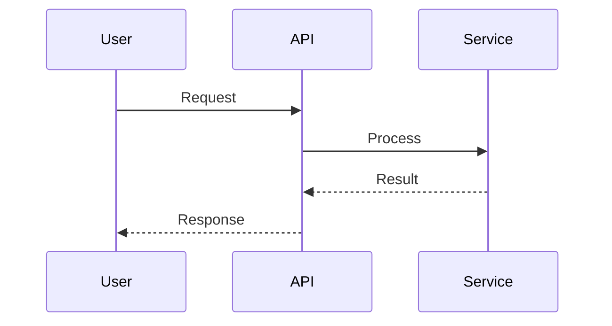
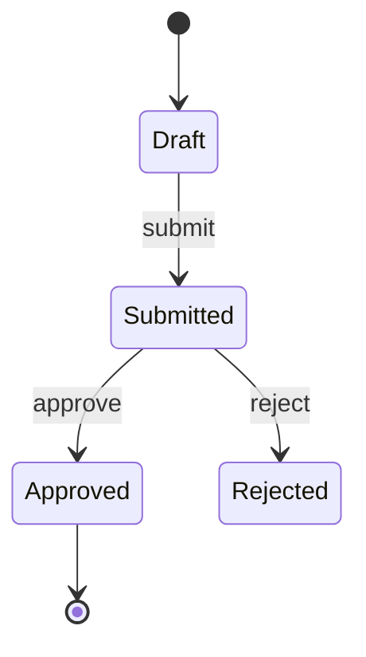
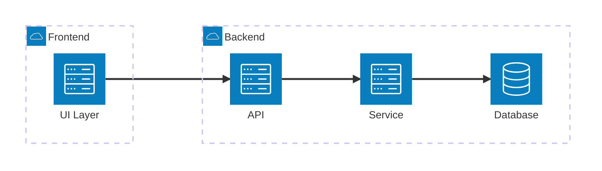
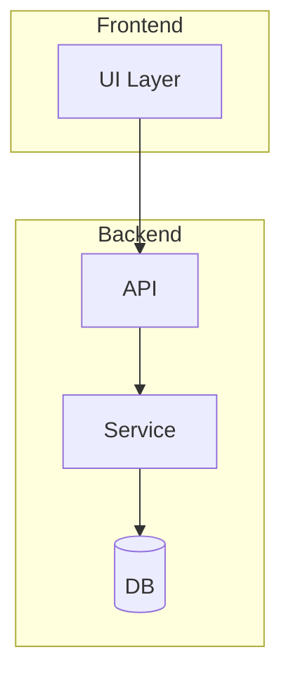
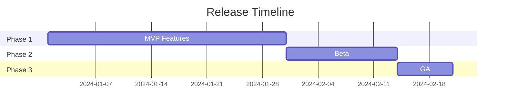

# /brainstorm - Interactive Design Session

## Purpose

Start an interactive brainstorming session using the one-question-at-a-time methodology. Refine rough ideas into fully-formed designs through collaborative dialogue.

**UX/UI Design Focus**: When designing user interfaces and experiences, this command adopts the perspective of a Product Owner with 10 years of experience in UX/UI design and product releases. The focus is on user value, market readiness, accessibility, and release strategy.

## Usage

```
/brainstorm [topic or feature to design]
```

## Arguments

- `$ARGUMENTS`: The topic, feature, or problem to brainstorm about

---

Start interactive brainstorming session for: **$ARGUMENTS**

## Recommended Skills & Agents

- Skill routing source: `.cursor/commands/skill-agent-routing.md` (`/brainstorm`)
- Preferred skills: `shape-spec`, `map-codebase`, `methodology-brainstorming`
- Recommended agents: `planner`, `scout`

## Methodology

**Reference**: `.cursor/rules/skills/methodology/brainstorming/skill.mdc`

This command uses the superpowers brainstorming methodology for optimal results.

## Workflow

### Phase 1: Understanding

**Goal**: Clarify requirements through sequential questioning.

**Rules**:
1. Ask **ONE question per message**
2. Wait for user response before next question
3. Prefer **multiple-choice** over open-ended questions
4. Break complex topics into multiple questions

**Example interaction**:
```
Claude: "What type of authentication should we support?
         a) Username/password only
         b) OAuth providers (Google, GitHub)
         c) Both options
         d) Magic link (passwordless)"

User: "b"

Claude: "Which OAuth providers should we integrate?
         a) Google only
         b) GitHub only
         c) Both Google and GitHub
         d) Let me specify others..."
```

### Phase 2: Exploration

**Goal**: Present alternatives with clear trade-offs.

Present 2-3 approaches:
- Lead with recommended option
- Explain trade-offs for each
- Let user choose direction

```markdown
## Approach 1: JWT-based (Recommended)
- Stateless, scalable
- Cons: Can't revoke instantly

## Approach 2: Session-based
- Easy revocation
- Cons: Requires session store

Which approach aligns better with your goals?
```

### Phase 3: Design Presentation

**Goal**: Present validated design incrementally.

**Rules**:
- Break into **200-300 word sections**
- Validate after each section
- Cover: architecture, components, data flow, error handling, testing

**Sections to present**:
1. Architecture overview
2. Component breakdown
3. Data flow
4. Error handling
5. Testing considerations

**Include Mermaid diagrams when they clarify**:
- **Sequence diagram**: Request/response flows, auth flows, multi-step processes
- **State diagram**: Entity lifecycles (order, user, session), status transitions
- **Architecture diagram**: System/component structure, layer boundaries, C4-style context
- **Gantt chart**: Phased rollout, parallel workstreams, release timelines (if relevant)

### Phase 4: UX/UI Design (Product Owner Perspective)

**Goal**: Design user experience and interface from product-market fit perspective.

**Role**: Act as Product Owner with 10 years of experience in UX/UI design and product releases.

**Approach**: Focus on user value, market readiness, and release strategy.

#### 4.1: User Research & Personas

**Questions to explore**:
- Who are the primary users? (Create user personas)
- What are their goals, pain points, and motivations?
- What is their technical proficiency level?
- What devices/platforms do they primarily use?
- What is their context of use? (mobile, desktop, on-the-go, etc.)

**Output**: User personas with:
- Demographics and background
- Goals and motivations
- Pain points and frustrations
- Technical comfort level
- Device preferences
- Usage context

#### 4.2: User Journey Mapping

**Questions to explore**:
- What is the user's journey from discovery to goal completion?
- What are the key touchpoints?
- Where are the friction points?
- What emotions does the user experience at each stage?
- What are the opportunities for improvement?

**Output**: User journey map with:
- Stages: Discovery → Onboarding → Usage → Retention
- Touchpoints at each stage
- User emotions and pain points
- Opportunities for improvement
- Success metrics at each stage

#### 4.3: Information Architecture

**Questions to explore**:
- How should information be organized?
- What is the navigation structure?
- What is the content hierarchy?
- How do users find what they need?
- What is the mental model users expect?

**Output**: Information architecture with:
- Site/app structure (sitemap)
- Navigation patterns (top nav, sidebar, tabs, etc.)
- Content hierarchy and prioritization
- Search and discovery mechanisms
- Mental model alignment

#### 4.4: UI Design Patterns & Components

**Questions to explore**:
- What design system should we use? (Material Design, Ant Design, custom, etc.)
- What UI patterns are most appropriate? (cards, lists, tables, forms, etc.)
- What components are needed? (buttons, inputs, modals, dropdowns, etc.)
- How should we handle responsive design?
- What are the accessibility requirements?

**Output**: UI design specification with:
- Design system choice and rationale
- Component library selection
- Responsive breakpoints (mobile, tablet, desktop)
- Accessibility standards (WCAG 2.1 AA minimum)
- Design tokens (colors, typography, spacing, shadows)

#### 4.5: Interaction Design

**Questions to explore**:
- What are the key interactions? (clicks, hovers, gestures, keyboard shortcuts)
- What feedback should users receive? (loading states, success messages, errors)
- How should errors be handled and displayed?
- What are the micro-interactions that enhance UX?
- What are the performance expectations? (load times, animation smoothness)

**Output**: Interaction design specification with:
- Key user interactions and flows
- Feedback mechanisms (toasts, modals, inline messages)
- Error handling and recovery
- Micro-interactions and animations
- Performance targets

#### 4.6: Prototyping & Testing Strategy

**Questions to explore**:
- What fidelity prototype is needed? (low, mid, high)
- What tools should we use? (Figma, Sketch, Framer, code prototype)
- Who should test? (internal team, beta users, target users)
- What should we test? (usability, desirability, feasibility)
- How will we collect and analyze feedback?

**Output**: Prototyping and testing plan with:
- Prototype fidelity and tools
- Testing methodology (usability testing, A/B testing, etc.)
- Test participant criteria
- Success metrics and KPIs
- Feedback collection and analysis process

#### 4.7: Product-Market Fit & Release Strategy

**Questions to explore**:
- What is the minimum viable product (MVP) scope?
- What features are must-have vs. nice-to-have?
- What is the release strategy? (big bang, phased rollout, beta)
- Who are the early adopters?
- What is the go-to-market plan?
- What are the success metrics post-launch?

**Output**: Product-market fit and release plan with:
- MVP feature set (prioritized)
- Release strategy (phased rollout, beta program, etc.)
- Early adopter targeting
- Go-to-market plan
- Success metrics (DAU, retention, conversion, NPS, etc.)
- Post-launch iteration plan

#### 4.8: Design Documentation

**Output**: Complete UX/UI design document with:
- User personas
- User journey maps
- Information architecture
- UI component specifications
- Interaction patterns
- Prototype links
- Testing results and insights
- Release strategy
- Success metrics

## Core Principles

### YAGNI Ruthlessly

Remove unnecessary features aggressively:
- Question every "nice to have"
- Start with minimal viable design
- "We might need this later" = remove it
- **UX/UI Focus**: Prioritize features that directly solve user problems

### One Question at a Time

Sequential questioning produces better results:
- Gives user time to think deeply
- Prevents overwhelming with choices
- Creates natural conversation flow
- **UX/UI Focus**: Understand user needs before designing solutions

### Multiple-Choice Preference

When possible, provide structured options:
- Reduces cognitive load
- Surfaces your understanding
- Makes decisions concrete
- **UX/UI Focus**: Present proven design patterns and let user choose

### User-Centric Design (Product Owner Perspective)

**10 Years of Experience Principles**:
- **User Value First**: Every design decision must answer "What value does this provide to users?"
- **Market Readiness**: Design for real users in real market conditions
- **Release Strategy**: Consider how design impacts launch and iteration
- **Metrics-Driven**: Define success metrics before design, measure after release
- **Accessibility by Default**: WCAG 2.1 AA minimum - not optional
- **Mobile-First**: Design for smallest screen first, enhance for larger
- **Performance Matters**: Fast experiences win - optimize for speed
- **Test Early, Test Often**: Validate assumptions with users before building
- **Iterate Based on Data**: Use real usage data to inform design improvements
- **Design for Scale**: Consider how design works at 10x, 100x user growth

## Output

After design is validated, create comprehensive design document.

**Mermaid diagrams**: Add sequence, state, architecture, or Gantt diagrams when they make the design clearer. Use fenced blocks with `mermaid` language.

```markdown
# Design: [Feature Name]
Date: [YYYY-MM-DD]

## Summary
[2-3 sentences]

## Architecture
[Architecture decisions]

Include **architecture diagram** (flowchart) when components/layers matter—see Mermaid Diagram Reference below.

## Components
[Component breakdown]

## Data Flow
[How data moves through system]

Include **sequence diagram** when request/response or multi-party flow matters—see Mermaid Diagram Reference below.

Include **state diagram** when status/lifecycle matters (e.g. order, user, session)—see Mermaid Diagram Reference below.

Include **Gantt chart** when phased rollout or parallel workstreams matter—see Mermaid Diagram Reference below.

## Error Handling
[Error scenarios and handling]

## Testing Strategy
[Testing approach]

---

## UX/UI Design

### User Research

#### Primary Personas
**Persona 1: [Name]**
- Demographics: [age, role, background]
- Goals: [primary goals]
- Pain Points: [frustrations]
- Technical Level: [beginner/intermediate/advanced]
- Device: [mobile/desktop/both]
- Context: [when/where they use the product]

#### Secondary Personas
[Additional personas if applicable]

### User Journey

#### Journey Map
| Stage | Touchpoint | User Action | Emotion | Pain Point | Opportunity |
|-------|-----------|------------|---------|------------|------------|
| Discovery | [touchpoint] | [action] | 😊/😐/😞 | [pain] | [improvement] |
| Onboarding | [touchpoint] | [action] | 😊/😐/😞 | [pain] | [improvement] |
| Usage | [touchpoint] | [action] | 😊/😐/😞 | [pain] | [improvement] |
| Retention | [touchpoint] | [action] | 😊/😐/😞 | [pain] | [improvement] |

### Information Architecture

#### Site/App Structure
```
[Home]
├── [Section 1]
│   ├── [Subsection 1.1]
│   └── [Subsection 1.2]
├── [Section 2]
└── [Section 3]
```

#### Navigation Pattern
- Primary: [top nav / sidebar / tabs / bottom nav]
- Secondary: [breadcrumbs / footer / search]
- Content hierarchy: [priority order]

### UI Design System

#### Design System
- **Choice**: [Material Design / Ant Design / Custom / etc.]
- **Rationale**: [why this system]

#### Design Tokens
- **Colors**: Primary (#hex), Secondary (#hex), Accent (#hex), Error (#hex), Success (#hex)
- **Typography**: Heading font, Body font, Sizes (h1-h6, body, caption)
- **Spacing**: Base unit (4px/8px), Scale (xs, sm, md, lg, xl)
- **Shadows**: Elevation levels
- **Border Radius**: Small, Medium, Large

#### Components
- **Form Elements**: [inputs, selects, checkboxes, radios, buttons]
- **Navigation**: [nav bars, menus, breadcrumbs]
- **Content**: [cards, lists, tables, modals]
- **Feedback**: [toasts, alerts, loading states]

#### Responsive Design
- **Mobile**: < 768px - [key considerations]
- **Tablet**: 768px - 1024px - [key considerations]
- **Desktop**: > 1024px - [key considerations]

#### Accessibility (WCAG 2.1 AA)
- **Color Contrast**: Minimum 4.5:1 for text
- **Keyboard Navigation**: All interactive elements accessible
- **Screen Readers**: Proper ARIA labels and semantic HTML
- **Focus Indicators**: Visible focus states
- **Alt Text**: All images have descriptive alt text

### Interaction Design

#### Key Interactions
- **Primary Actions**: [main user actions and how they work]
- **Secondary Actions**: [supporting actions]
- **Gestures**: [swipe, pinch, drag, etc. if applicable]
- **Keyboard Shortcuts**: [if applicable]

#### Feedback Mechanisms
- **Loading States**: [how loading is indicated]
- **Success Feedback**: [how success is communicated]
- **Error Feedback**: [how errors are displayed and handled]
- **Micro-interactions**: [delightful details]

#### Performance Targets
- **First Contentful Paint**: < 1.5s
- **Time to Interactive**: < 3.5s
- **Animation**: 60fps smooth
- **Perceived Performance**: [optimistic UI patterns]

### Prototyping & Testing

#### Prototype
- **Fidelity**: [low / mid / high]
- **Tool**: [Figma / Sketch / Framer / Code]
- **Link**: [prototype URL if available]

#### Testing Plan
- **Methodology**: [usability testing / A/B testing / beta program]
- **Participants**: [target user criteria]
- **Scenarios**: [key tasks to test]
- **Success Criteria**: [what defines success]

#### Testing Results
- **Key Findings**: [insights from testing]
- **Issues Found**: [problems discovered]
- **Improvements Made**: [changes based on feedback]

### Product-Market Fit & Release

#### MVP Scope
**Must-Have Features** (v1.0):
- [Feature 1] - [rationale]
- [Feature 2] - [rationale]

**Nice-to-Have Features** (v1.1+):
- [Feature 3] - [rationale]
- [Feature 4] - [rationale]

#### Release Strategy
- **Approach**: [big bang / phased rollout / beta program]
- **Phase 1**: [initial release scope]
- **Phase 2**: [follow-up release scope]
- **Beta Program**: [if applicable, criteria and timeline]

#### Early Adopters
- **Target**: [who are the early adopters]
- **Value Proposition**: [why they'll use it]
- **Onboarding**: [how to get them started]

#### Go-to-Market Plan
- **Channels**: [how to reach users]
- **Messaging**: [key value propositions]
- **Timeline**: [launch schedule]

#### Success Metrics
**Primary Metrics**:
- **User Acquisition**: [DAU, MAU, sign-ups]
- **Engagement**: [session duration, actions per session]
- **Retention**: [Day 1, Day 7, Day 30 retention]
- **Conversion**: [if applicable, conversion rate]
- **Satisfaction**: [NPS, CSAT, user feedback]

**Secondary Metrics**:
- [Additional metrics relevant to the feature]

#### Post-Launch Iteration
- **Week 1**: [immediate fixes and improvements]
- **Month 1**: [short-term enhancements]
- **Quarter 1**: [long-term roadmap items]

---

## Open Questions
[Any remaining unknowns]

## Next Steps
1. [Action item 1]
2. [Action item 2]
3. [Action item 3]
```

### Mermaid Diagram Reference

Use Mermaid in design docs when they clarify. Fence with ` ```mermaid ` and ` ``` `.

**Ref**: [Mermaid Diagram Syntax](https://mermaid.js.org/syntax/flowchart.html) — Flowchart, Sequence, Class, State, ER, User Journey, Gantt, Pie, Quadrant, Requirement, GitGraph, C4, Mindmap, Timeline, ZenUML, Sankey, XY Chart, Block, Packet, Kanban, Architecture, Radar, Treemap.

**When to use**:
- **Sequence diagram**: Request/response, auth flows, multi-step flows between actors
- **State diagram**: Entity lifecycles (order, user, session), status transitions
- **Architecture diagram** (`architecture-beta`): Cloud/CI‑CD, services and groups with icons (v11.1.0+)
- **Flowchart**: System/component structure, layers, boundaries (generic)
- **Gantt chart**: Phased rollout, parallel workstreams, release timelines

**Sequence diagram** (participants, messages) — use in Data Flow, auth/request flows:


**State diagram** (lifecycle/status) — use for order, user, session, approval flows:


**Architecture diagram** (`architecture-beta`, v11.1.0+) — Cloud/CI‑CD, services & groups with icons. Building blocks: **groups** `group id(icon)[title] (in parent)?`, **services** `service id(icon)[title] (in groupId)?`, **edges** `id:R --> L:otherId` (L|R|T|B). Icons: `cloud`, `database`, `disk`, `internet`, `server`. [Docs](https://mermaid.js.org/syntax/architecture.html)


**Flowchart** (generic layers/components) — use when architecture-beta is not needed:


**Gantt chart** (phases/timeline) — use in Release Strategy, phased rollout:


**All Mermaid diagram types** — use when they fit the design. Ref: [mermaid.js.org Diagram Syntax](https://mermaid.js.org/syntax/flowchart.html).

| Type | When to use | Docs |
|------|-------------|------|
| **Flowchart** | Processes, decisions, layers, subgraphs | [flowchart](https://mermaid.js.org/syntax/flowchart.html) |
| **Sequence** | Request/response, auth, multi-actor flows | [sequenceDiagram](https://mermaid.js.org/syntax/sequenceDiagram.html) |
| **Class** | UML classes, attributes, relations (inheritance, composition) | [classDiagram](https://mermaid.js.org/syntax/classDiagram.html) |
| **State** | Lifecycles, status transitions | [stateDiagram](https://mermaid.js.org/syntax/stateDiagram.html) |
| **ER** | Entity-relationship, data model | [entityRelationshipDiagram](https://mermaid.js.org/syntax/entityRelationshipDiagram.html) |
| **User Journey** | Journey map, touchpoints, phases | [userJourney](https://mermaid.js.org/syntax/userJourney.html) |
| **Gantt** | Phases, timelines, release plan | [gantt](https://mermaid.js.org/syntax/gantt.html) |
| **Pie** | Proportions, breakdown | [pie](https://mermaid.js.org/syntax/pie.html) |
| **Quadrant** | 2x2 matrix, prioritization | [quadrantChart](https://mermaid.js.org/syntax/quadrantChart.html) |
| **Requirement** | Requirements, traceability | [requirementDiagram](https://mermaid.js.org/syntax/requirementDiagram.html) |
| **GitGraph** | Branches, commits, merges | [gitgraph](https://mermaid.js.org/syntax/gitgraph.html) |
| **C4** ⚠️ | Context/containers (C4 model) | [c4](https://mermaid.js.org/syntax/c4.html) |
| **Mindmap** | Ideas, hierarchy | [mindmap](https://mermaid.js.org/syntax/mindmap.html) |
| **Timeline** | Milestones, events | [timeline](https://mermaid.js.org/syntax/timeline.html) |
| **ZenUML** | Sequence/flow in ZenUML style | [zenuml](https://mermaid.js.org/syntax/zenuml.html) |
| **Sankey** 🔥 | Flow volumes between nodes | [sankey](https://mermaid.js.org/syntax/sankey.html) |
| **XY Chart** 🔥 | Scatter/line, metrics | [xyChart](https://mermaid.js.org/syntax/xyChart.html) |
| **Block** 🔥 | Block structure | [blockDiagram](https://mermaid.js.org/syntax/blockDiagram.html) |
| **Packet** 🔥 | Packet/network frames | [packet](https://mermaid.js.org/syntax/packet.html) |
| **Kanban** 🔥 | Board, columns, cards | [kanban](https://mermaid.js.org/syntax/kanban.html) |
| **Architecture** 🔥 | Cloud/CI‑CD, groups, services (v11.1+) | [architecture](https://mermaid.js.org/syntax/architecture.html) |
| **Radar** 🔥 | Radar/spider chart | [radar](https://mermaid.js.org/syntax/radar.html) |
| **Treemap** 🔥 | Hierarchical data, size-based | [treemap](https://mermaid.js.org/syntax/treemap.html) |
| **Other** | More examples | [examples](https://mermaid.js.org/syntax/examples.html) |

## Next Steps After Brainstorming

After design is complete:
1. **Save Design Document (if --save flag provided)**
   - **Reference**: `.cursor/rules/output-paths.mdc`
   - Extract directory from save path (e.g., `docs/03-design/payment.md` → `docs/03-design/`)
   - Ensure directory exists (create if needed, including parent `docs/` if necessary)
   - Save design document to specified path
   - **For UX/UI Design**: Include prototype links, user research findings, and testing results

2. **UX/UI Design Deliverables** (if Phase 4 completed):
   - Create high-fidelity prototypes (Figma/Sketch/Framer)
   - Conduct user testing sessions
   - Document design system and component library
   - Create user journey maps and personas
   - Define success metrics and KPIs
   - Prepare go-to-market plan

3. **Review Design**:
   - Use `/review-brainstorm [design-file]` to review design quality
   - Get stakeholder feedback
   - Iterate based on feedback

4. **Implementation Planning**:
   - Use `/plan --detailed` for implementation planning
   - Include UX/UI implementation tasks in plan
   - Plan for design system setup and component development

5. **Execution**:
   - Use `/execute-plan` for automated implementation
   - Ensure UI components match design specifications
   - Test accessibility and responsive design
   - Validate against user journey maps

## Flags

| Flag | Description | Example |
|------|-------------|---------|
| `--mode=[mode]` | Use specific behavioral mode | `--mode=brainstorm` |
| `--depth=[1-5]` | Exploration depth level | `--depth=4` |
| `--format=[fmt]` | Output format (concise/detailed) | `--format=detailed` |
| `--save=[path]` | Save design document to file | `--save=docs/design.md` |
| `--quick` | Shorter session, fewer questions | `--quick` |
| `--comprehensive` | Longer session, thorough exploration | `--comprehensive` |

### Flag Usage Examples

```bash
# Comprehensive design with UX/UI focus
/brainstorm --comprehensive "authentication system design"

# Save design document
/brainstorm --save=docs/payment-design.md "payment integration"

# Quick feature design
/brainstorm --quick "simple file upload feature"

# Deep architecture exploration
/brainstorm --depth=5 "microservices architecture"

# UX/UI focused brainstorming
/brainstorm --comprehensive "user dashboard interface design"
```

### Session Depth

| Level | Questions | Exploration |
|-------|-----------|-------------|
| 1 | 2-3 | Quick validation only |
| 2 | 4-5 | Standard session |
| 3 | 6-8 | Thorough exploration |
| 4 | 8-10 | Comprehensive |
| 5 | 10+ | Exhaustive, all angles |

## MCP Integration

This command leverages MCP servers for enhanced brainstorming:

### Sequential Thinking - Structured Exploration (Primary)
```
ALWAYS use Sequential Thinking for brainstorming:
- Explore design options systematically
- Track pros/cons for each approach
- Revise conclusions based on user feedback
- Build confidence in final design incrementally
- For UX/UI: Map user journeys step-by-step, validate each touchpoint
```

### Memory - Design Persistence
```
Store design decisions for continuity:
- Create entities for design concepts
- Store user preferences and constraints
- Recall previous design patterns
- Build knowledge graph of architecture decisions
- For UX/UI: Remember user personas, design system choices, testing insights
```

### Context7 - Technology Options
```
When exploring technology choices:
- Fetch current documentation for options
- Compare library capabilities accurately
- Understand trade-offs with real data
- For UX/UI: Research design systems, component libraries, accessibility tools
```

---

## Next Steps & User Guidance

### Immediate Actions

1. **Review the Design**
   - [ ] Verify all phases are complete (Architecture, UX/UI Design)
   - [ ] Check user personas and journey maps are realistic
   - [ ] Confirm design system and components are specified
   - [ ] Review accessibility requirements (WCAG 2.1 AA)
   - [ ] Validate release strategy and success metrics
   - [ ] Ensure MVP scope is clearly defined

2. **Next Commands to Use**
   - Use `/review-brainstorm [design-file]` to review design quality
   - Use `/plan --detailed` to create implementation plan from design
   - Use `/execute-plan [plan-file]` to implement the design
   - **For UX/UI**: Create prototypes and conduct user testing before implementation
   - **For UX/UI**: Use `/review` to review UI implementation against design specs

3. **Update or Improve**
   - To update: Edit design document directly or run `/brainstorm` again with modifications
   - To improve: Use `/review-brainstorm` for suggestions
   - To extend: Add new features or UX improvements to design document

### Related Commands

| Command | Purpose | When to Use |
|---------|---------|-------------|
| `/review-brainstorm` | Review design quality | After creating design, before planning |
| `/plan --detailed` | Create implementation plan | After design is approved |
| `/execute-plan` | Execute design implementation | After plan is created and reviewed |
| `/review` | Review UI implementation | After implementation to verify design match |
| `/test` | Test UI components | During/after implementation |

### Common Workflows

**Workflow: Brainstorm → Review → Plan → Execute**
```
/brainstorm "feature" → /review-brainstorm design.md → /plan --detailed "from design" → /execute-plan plan.md
```

**Workflow: Brainstorm → Prototype → Test → Plan (UX/UI Focus)**
```
/brainstorm "UI feature" → Create prototype → User testing → /plan --detailed "from tested design" → /execute-plan
```

**Workflow: Brainstorm → Iterate → Review → Plan**
```
/brainstorm "feature" → Iterate based on feedback → /review-brainstorm design.md → /plan --detailed
```

### Tips

- 💡 **Tip**: Complete all phases (1-4) for comprehensive design, especially UX/UI Phase 4
- 💡 **Tip**: Use `--comprehensive` flag for thorough UX/UI design exploration
- 💡 **Tip**: Save design document with `--save` flag for future reference
- 💡 **Tip**: For UX/UI design, always define success metrics before implementation
- 💡 **Tip**: Test prototypes with real users before building - saves time and money
- 💡 **Tip**: Design mobile-first, then enhance for desktop
- ⚠️ **Warning**: Don't skip UX/UI Phase 4 - it's critical for product success
- ⚠️ **Warning**: Accessibility (WCAG 2.1 AA) is not optional - design for all users
- ⚠️ **Warning**: Validate assumptions with users before building - avoid costly rework

### UX/UI Design Best Practices

**Before Implementation**:
1. **Create Prototypes**: High-fidelity prototypes help catch issues early
2. **User Testing**: Test with 5-8 target users to find major issues
3. **Accessibility Audit**: Check prototypes with screen readers and keyboard navigation
4. **Performance Planning**: Design for fast load times (< 3s Time to Interactive)
5. **Responsive Testing**: Test on real devices, not just emulators

**During Implementation**:
1. **Design System Setup**: Set up design tokens and component library first
2. **Component Development**: Build reusable components matching design specs
3. **Accessibility Implementation**: Ensure WCAG 2.1 AA compliance from start
4. **Performance Optimization**: Optimize images, lazy load, code split
5. **Cross-Browser Testing**: Test on Chrome, Firefox, Safari, Edge

**After Release**:
1. **Monitor Metrics**: Track success metrics defined in design
2. **Collect Feedback**: Gather user feedback through surveys, interviews, support tickets
3. **A/B Testing**: Test design variations to optimize conversion
4. **Iterate Based on Data**: Use real usage data to inform improvements
5. **Accessibility Maintenance**: Regular audits to maintain WCAG compliance

### File Naming

**Reference**: `.cursor/rules/file-naming-prefix.mdc`

When using `--save` flag without explicit filename:
- Auto-generates: `docs/03-design/DS001-[descriptive-name].md`
- Prefix: `DS` (Design)
- Numbers increment sequentially (DS001, DS002, DS003...)

**Example**:
```bash
/brainstorm --save "user dashboard design"
# Generates: docs/03-design/DS001-user-dashboard-design.md
```

## When NOT to Use

- Clear "mechanical" processes with known implementation
- Simple bug fixes with obvious solutions
- Tasks with explicit requirements already defined

Use direct implementation instead.

## UX/UI Design Examples

### Example 1: User Dashboard Design

**Scenario**: Designing a user dashboard for a SaaS product

**Phase 4 Questions**:
1. "Who are the primary users of this dashboard?
   a) Business owners tracking metrics
   b) Team managers coordinating work
   c) Individual contributors managing tasks
   d) All of the above"

2. "What is the primary goal users want to achieve?
   a) Quick overview of key metrics
   b) Detailed analysis and reporting
   c) Task management and workflow
   d) All of the above"

3. "What devices will users primarily use?
   a) Desktop only
   b) Mobile only
   c) Both, but desktop primary
   d) Both, but mobile primary"

**Output**: Complete UX/UI design with personas, journey map, information architecture, component specifications, and release strategy.

### Example 2: Mobile App Onboarding

**Scenario**: Designing onboarding flow for mobile app

**Phase 4 Focus**:
- User personas (first-time mobile app users)
- User journey (download → install → first launch → first action)
- Information architecture (onboarding screens structure)
- UI patterns (progressive disclosure, skip options)
- Interaction design (swipe gestures, animations)
- Testing strategy (A/B test different flows)
- Release strategy (soft launch to beta users first)

### Example 3: E-commerce Checkout Flow

**Scenario**: Redesigning checkout process

**Phase 4 Focus**:
- User personas (casual shoppers, power users, mobile shoppers)
- User journey (cart → checkout → payment → confirmation)
- Information architecture (step-by-step vs. single page)
- UI patterns (form design, payment methods, trust signals)
- Interaction design (auto-fill, validation, error handling)
- Accessibility (keyboard navigation, screen reader support)
- Performance (fast checkout = higher conversion)
- Metrics (conversion rate, cart abandonment, checkout time)

## UX/UI Design Focus Areas

When brainstorming UX/UI design, the Product Owner perspective emphasizes:

### 1. User Research & Validation
- Understand real users, not assumptions
- Validate problems before designing solutions
- Test with target users early and often

### 2. Product-Market Fit
- Design features that solve real market problems
- Prioritize based on user value, not technical complexity
- Consider competitive landscape and differentiation

### 3. Release Strategy
- Design MVP that can be released quickly
- Plan for phased rollout and iteration
- Design for learnability and quick time-to-value

### 4. Accessibility & Inclusion
- Design for all users, including those with disabilities
- Follow WCAG 2.1 AA standards minimum
- Test with assistive technologies

### 5. Performance & Scalability
- Design for fast load times and smooth interactions
- Consider performance at scale (10x, 100x users)
- Optimize for perceived performance

### 6. Metrics & Success Criteria
- Define success metrics before design
- Design for measurable outcomes
- Plan for post-launch measurement and iteration

### 7. Design Systems & Consistency
- Use established design systems when possible
- Maintain consistency across features
- Build reusable component library

### 8. Responsive & Multi-Platform
- Design mobile-first, enhance for desktop
- Consider cross-platform consistency
- Test on real devices, not just emulators

### 9. Error Handling & Edge Cases
- Design graceful error states
- Handle edge cases and empty states
- Provide clear recovery paths

### 10. Onboarding & Discoverability
- Design intuitive onboarding flows
- Make features discoverable without documentation
- Provide contextual help and guidance
