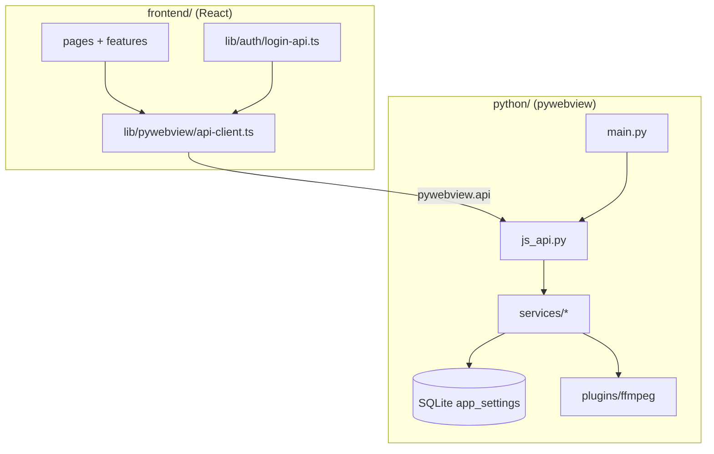

# Architecture Context — JOS One

Evidence-cited map of how the desktop app is structured. **Scope:** request/UI → Python bridge → services → FFmpeg/plugins. **Out of scope:** `.cursor` toolkit internals, one-off scripts in `test/`.

## Entry points

| Entry | File:line | Trigger |
|-------|-----------|---------|
| Desktop host | `python/main.py:35` — `main()` | `uv run python -m python.main` / `make start` / `make dev` |
| Frontend bootstrap | `frontend/src/main.tsx` | Vite loads React app |
| Router | `frontend/src/routes/app-router.tsx:10` | `HashRouter` routes |
| JsApi (JS → Python) | `python/api/js_api.py:32` — `JsApi` | `window.pywebview.api.*` after bridge ready |

## High-level flow

## Python host (`python/main.py`)

1. `setup_logging`, `init_database()` — SQLite at path from `get_database_path()` (`python/config.py`).
2. `download_plugins_in_background()` — ffmpeg binaries (`python/services/plugin_downloader.py`).
3. `webview.create_window(..., js_api=JsApi())` — URL from `resolve_url()` (dev server vs `frontend/dist`).
4. On `window.events.loaded`: attach `WindowBridge` to JsApi (`python/bridge/window_bridge.py`) for native dialogs.
5. On close: `shutdown_ffmpeg_workers()` (`python/services/app_shutdown.py`).

**Windows note:** `WindowBridge` is set on `loaded`, not at create time, to avoid pywebview WinForms accessibility log noise (see `README.md`).

## Bridge contract

- **Rule:** UI must use `createBridgeClient()` / hooks under `frontend/src/lib/pywebview/*` — **not** raw `window.pywebview.api` from pages.
- **Desktop vs browser:** `isPywebviewShell()` gates behavior; `make local` uses HTTP auth mock/fallback (`frontend/src/lib/auth/login-http.ts`).
- **Errors:** `BridgeNotReadyError`, `PythonApiError` (`frontend/src/lib/pywebview/errors.ts`).

### JsApi surface (`python/api/js_api.py`)

| Method | Service / module |
|--------|------------------|
| `ping`, `get_app_info` | `python/services` |
| `login` | `python/services/auth_login.py` |
| `get_login_settings`, `save_login_settings` | `python/services/settings_service.py` |
| `open_*_dialog`, `list_videos_in_folder`, `probe_videos_in_folder` | `python/services/video_merge/io.py` |
| `start_video_merge_job`, `get_video_merge_job_status`, `cancel_video_merge_job` | `python/services/video_merge/job.py` |
| `get_ffmpeg_status` | `python/services/plugin_downloader.py` |

Video merge pipeline: `io.py` → `pipeline.py` → `job.py` + `ffmpeg_pool.py`; uses **ffmpeg-python** + bundled `plugins/ffmpeg` binaries.

## Frontend routing (`frontend/src/routes/app-router.tsx`)

| Path | Page | Auth |
|------|------|------|
| `/login` | `LoginPage` | Public |
| `/` | `VideoMergePage` | Protected + `AppShell` |
| `/prompt` | `PromptAiPage` | Protected |
| `/settings` | `SettingsPage` | Protected |
| `/overview`, `/messages`, `/orders` | Redirect → `/` | — |

Auth guard: `frontend/src/features/auth/protected-route.tsx` + `useAuthStore` (`frontend/src/stores/auth-store.ts`).

## Configuration

| Concern | Location |
|---------|----------|
| App env, URLs, window size | `python/config.py` |
| Auth API URL (desktop) | `AUTH_API_URL` env → `get_auth_api_url()` |
| Auth API URL (browser local) | `frontend/.env` → `VITE_AUTH_API_URL` |
| Dev server URL | `DEV_SERVER_URL` (default `http://127.0.0.1:5173`) |
| SQLite DB | `data/` under repo or app data dir (`get_database_path()`) |

## Testing layout

| Suite | Command | Path |
|-------|---------|------|
| Python unit/integration | `uv run pytest` | `python/tests/` |
| Frontend unit | `yarn --cwd frontend test` | Vitest next to sources |
| E2E (optional) | `RUN_PYAUTO_E2E=1` | `python/tests/e2e/` |

Integration tests marked `@pytest.mark.integration` need `plugins/ffmpeg.exe`.

## Open questions

- **macOS/Linux packaging** — Makefile and PyInstaller path are Windows-oriented; confirm targets before porting.
- **Prompt AI (`/prompt`)** — UI shell exists; backend integration TBD (placeholder-level).
