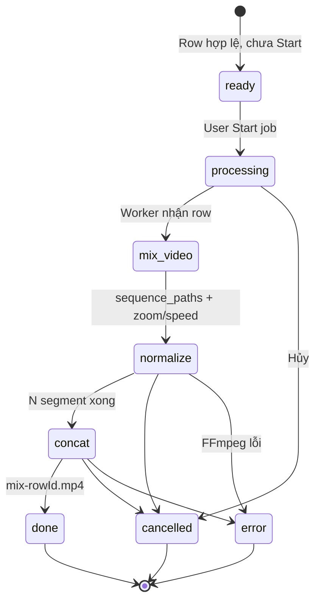
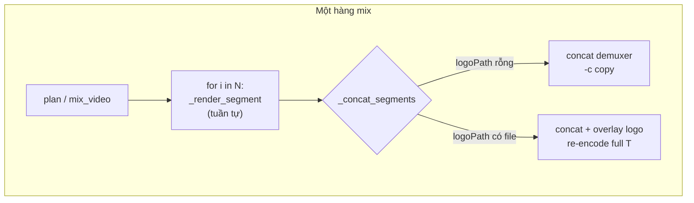
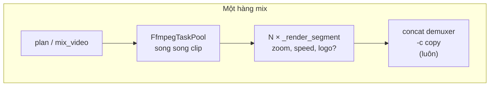

# RS003 — FFmpeg merge: phân tích `docs/ffmpeg.json` và tối ưu pipeline JOS One

**Ngày:** 2026-05-29  
**Phạm vi:** Chuẩn hóa clip (zoom/speed), nối video, logo — so sánh preset legacy (`docs/ffmpeg.json`) với `python/services/video_merge/pipeline.py`.

---

## 1. Tóm tắt điều hành

| Khía cạnh | Legacy (`ffmpeg.json`) | Pipeline hiện tại (`pipeline.py`) |
|-----------|------------------------|-----------------------------------|
| Mô hình | **1 lệnh / 1 clip** (filter dài, encode 1 lần) | **N encode clip** + **1 concat** (copy hoặc encode lại) |
| Nối nhiều đoạn | Hầu hết **không nối**; vài mẫu `concat=n=` (audio hoặc claim) | `concat` demuxer + `-c copy` (không logo) |
| Chuẩn hóa | `setpts`, `crop`, `rotate`, `scale`, `atempo` trong 1 graph | `scale` + `fps` + `setpts` + `atempo` / `atrim` |
| Logo | `overlay` / `scale2ref` trong cùng graph | Hiện tại: overlay **sau** concat → re-encode; **mục tiêu:** overlay **khi chuẩn hóa** (DS004) |
| Preset | `veryfast` (~463 lần), `-b:v @bitrate@k` | `libx264 -preset fast -crf 20` hoặc NVENC `p4` |
| Song song | Không (CLI tuần tự) | Song song **theo hàng mix**; clip trong hàng **tuần tự** |

**Bottleneck chính hiện tại:** mỗi clip trong sequence = 1 lần encode H.264 đầy đủ; khi có logo, concat cũng encode lại toàn timeline. `FfmpegTaskPool` đã có nhưng **chưa được gọi** từ `render_mix_row`.

**Ưu tiên tối ưu (ước lượng tác động):**

1. Gắn `FfmpegTaskPool` vào `render_mix_row` (song song clip trong hàng).
2. Segment dùng preset nhanh hơn (`veryfast` / CRF cao hơn); concat không logo giữ `-c copy`.
3. Logo: **gắn trên mỗi clip khi chuẩn hóa**; concat luôn `-c copy` (DS004).
4. Bật/tinh chỉnh NVENC + `-threads 0` trên CPU.
5. (Dài hạn) Một `filter_complex` multi-input như legacy Id 598 — 1 encode cho cả hàng (khó với random zoom/speed từng clip).

---

## 2. Thống kê `docs/ffmpeg.json` (642 preset)

Phân tích tự động trên toàn file:

| Chỉ số | Số lượng |
|--------|----------|
| Entry | 642 |
| Entry nhiều lệnh (`\n####\n`) | 168 |
| `-preset veryfast` | 463 |
| `-preset fast` | 67 |
| `libx264` | 527 |
| `-c:v copy` / copy | 24 |
| `concat=n=` (filter) | 9 (chủ yếu audio + claim) |
| `-f concat` demuxer | 0 |
| `overlay` | 566 |
| `setpts=PTS/` (speed) | 639 |
| `scale2ref` (logo QR) | 19 |
| `-threads 0` | 67 |
| `h264_nvenc` | 6 |
| `hwaccel` / CUDA | 0 |

**Kết luận:** Legacy tối ưu **tốc độ encode đơn clip** (`veryfast`, bitrate cố định), không tối ưu **pipeline nhiều clip**. JOSVN tách normalize + concat là đúng hướng cho concat copy; đổi lại trả giá **N lần encode**.

---

## 3. Mẫu lệnh legacy theo chức năng

### 3.1 Chuẩn hóa (zoom / speed / crop)

**Facebook vuông (Id 74–125)** — gần với “random zoom + speed”:

```text
[0:v]setpts=PTS/1.19,
     rotate=1*(PI/180),
     crop=iw/1.285:ih/1.05,
     setpts=PTS/@speed@[v1];
[v1]scale=1000:1000,setdar=1/1[v2];
...
[vs][v3]overlay=0:0,scale=@resolution@;
[0:a]atempo=1.19,atempo=@speed@,...
```

- Zoom gián tiếp: `crop` thu nhỏ FOV + `scale` về khung.
- Speed: **hai** `setpts` video + **hai** `atempo` audio.
- Thêm `blend` viền (`Vien.png`), `aecho`, `amovie` nhạc nền.

**Pipeline hiện tại** (`_build_video_filter_chain`):

```text
setpts=PTS-STARTPTS,
scale={zoomW}:{zoomH}[,fps={fps}],
setpts=PTS/{speed},
format=yuv420p
```

| | Legacy | JOSVN |
|---|--------|-------|
| Xoay / crop ngẫu nhiên | Có | Không (chỉ scale zoom) |
| Đổi FPS | Implicit qua `-r` / scale | `fps=` filter (tốn CPU) |
| Speed audio | `atempo` xích | `atrim` + `atempo` |
| Encode | 1 pass / clip | 1 pass / clip (tương đương) |

### 3.2 Logo

**Logo góc (logochumo + scale2ref):**

```text
[1:v][v2]scale2ref=oh*mdar:ih/9[QR][v3];
[v3][QR]overlay=10:10,drawtext=...
```

**Logo full-frame (filterchumo):**

```text
[2:v]scale=1280:720[vcc];
[v4][vcc]overlay=0:0
```

**JOSVN** (`_concat_segments` khi có logo):

```text
-f concat -i list.txt -i logo.png
-filter_complex [0:v][1:v]overlay={position}[vout]
→ encode lại **toàn bộ** video đã nối
```

→ Đây là điểm chậm lớn khi bật logo: mất lợi thế `-c copy` của concat.

### 3.3 Nối video

**Audio splice, giữ video copy (nhiều preset Claim):**

```text
[aud1][aud2][aud3]concat=n=3:v=0:a=1[aout]
-map 0:v -map [aout] -c:v copy
```

**Nối cả video + audio (Id 598 — claim chèn đoạn):**

```text
[v0][a0][v1][a1][v2][a2]concat=n=3:v=1:a=1[outv][outa]
-threads 0 -preset veryfast
```

**JOSVN (code hiện tại → mục tiêu DS004):**

```text
# Không logo (đã đúng):
-f concat -safe 0 -i concat_list.txt -c copy output.mp4

# Có logo — hiện tại (chậm):
concat demuxer → overlay logo → libx264/NVENC + AAC  # encode full T

# Có logo — mục tiêu:
_render_segment: filter + overlay logo → encode segment
concat demuxer -c copy   # không encode lại
```

Legacy **không** dùng concat demuxer; JOSVN **đúng** cho nhánh không logo.

---

## 4. Pipeline — state machine & chi phí

Phân biệt **code hiện tại** (`pipeline.py` tại thời điểm RS003) và **mục tiêu** sau DS004 (logo khi chuẩn hóa, concat luôn copy).

### 4.1 State machine (mỗi mix row)



| Phase UI (VN) | `status` | `phase` (`ROW_PHASE_*`) | Việc làm | FFmpeg |
|---------------|----------|-------------------------|----------|--------|
| **Sẵn sàng** | `pending` | `""` | Validation FE; chưa job | — |
| **Đang xử lý** | `running` | `processing` | Row vào queue (`job.py`) | — |
| **Mix video** | `running` | `mix_video` | Gán `sequence_paths`, random zoom/speed | — |
| **Chuẩn hóa** | `running` | `normalize` | `_render_segment` × N | **N × encode** |
| **Nối video** | `running` | `concat` | `_concat_segments` | **1 × copy** (mục tiêu) |
| Xong | `done` | `concat` | Ghi `outputs[]`, probe duration | — |

**Label UI:** “Nối video (thêm logo)” → **“Nối video”** khi logo đã burn-in ở chuẩn hóa (DS004).

### 4.2 Luồng FFmpeg — hiện tại vs mục tiêu

**Code hiện tại** (`render_mix_row`):



**Mục tiêu DS004:**



| Bước | Hiện tại | Mục tiêu (DS004) |
|------|----------|------------------|
| Chuẩn hóa | `_render_segment` — scale, fps, zoom, speed; **không logo** | Cùng filter + **`overlay` logo** nếu `logoPath` |
| Nối, không logo | `-f concat -c copy` | Giữ nguyên |
| Nối, có logo | concat → overlay → **libx264/NVENC encode cả T** | **Chỉ `-c copy`** (logo đã trong segment) |
| Song song clip | Vòng `for` tuần tự | `FfmpegTaskPool` (`concurrency` workers) |
| Song song row | `ThreadPoolExecutor` trong `job.py` | Giữ nguyên |

### 4.3 Chi phí encode (bottleneck)

Ký hiệu: **N** clip, tổng thời lượng output **T** (giây), tốc độ encode trung bình **R**× (từ log `speed=`), **W** = `concurrency` workers, **L** = overhead overlay logo trên 1 clip (≈ 5–15% thời gian segment nếu PNG nhỏ).

| Kịch bản | Số lần encode video (≈) | Thời gian wall-clock normalize | Thời gian join | Tổng encode-equivalent |
|----------|---------------------------|--------------------------------|----------------|-------------------------|
| **Hiện tại**, không logo | N segment | `(T/R) / W`* | ~0 (copy) | **T/R** |
| **Hiện tại**, có logo | N segment + **1× full T** | `(T/R) / W`* | **T/R** (re-encode) | **2T/R** |
| **Mục tiêu**, không logo | N segment | `(T/R) / W` | ~0 | **T/R** |
| **Mục tiêu**, có logo | N segment (+ overlay nhẹ) | `(T/R × (1+L)) / W` | ~0 | **T/R × (1+L)** |

\* Hiện tại `W` hiệu quả = **1** trên normalize vì clip tuần tự; pool chưa gắn.

**Ví dụ:** N=10, T=300s, R=2×, W=4, L=10%

| | Hiện tại + logo | Mục tiêu + logo |
|---|-----------------|-----------------|
| Normalize | ~150s (tuần tự) | ~150s × 1.1 / 4 ≈ **41s** |
| Join | ~150s (encode) | **~0 s** (copy) |
| **Tổng** | **~300s** | **~42s** |

Chi phí logo **mục tiêu** ≈ thêm **L%** trên mỗi segment (đã trong pass encode sẵn có), không thêm pass full-length.

### 4.4 Encoder & song song (snapshot code)

**Encoder segment** (`_video_codec_args` — hiện tại):

- CPU: `libx264 -preset fast -crf 20`
- GPU: `h264_nvenc -preset p4 -rc vbr -cq 20` (nếu `nvcuda.dll`)

**Mục tiêu P0** (RS003 §5): segment `veryfast` / `crf 23`, `-threads 0`; NVENC `p5`–`p6`.

**Song song:**

| Tầng | Module | Hiện tại | Gap |
|------|--------|----------|-----|
| Nhiều hàng mix | `job.py` | `ThreadPoolExecutor(workers=concurrency)` | — |
| Clip trong hàng | `render_mix_row` | `for` tuần tự | Cần `FfmpegTaskPool` |
| Pool | `ffmpeg_pool.py` | Có + test | Chưa gọi từ `render_mix_row` |

**Tham chiếu thiết kế đầy đủ:** `docs/03-design/DS004-ffmpeg-python-video-merge.md`.

---

## 5. Đề xuất tối ưu (có thể làm trong repo)

### P0 — Quick wins (ít rủi ro)

| # | Thay đổi | Lý do | File gợi ý |
|---|----------|-------|------------|
| 1 | Dùng `FfmpegTaskPool` trong `render_mix_row` | Giảm wall-clock ≈ min(N, concurrency) trên normalize | `pipeline.py`, `job.py` |
| 2 | Segment: `-preset veryfast` + `-crf 23` (hoặc cấu hình “draft”) | Khớp 463/642 preset legacy; concat copy giữ chất lượng segment | `pipeline.py`, `io.py` |
| 3 | Thêm `-threads 0` cho libx264 | Legacy dùng 67 lần; tận dụng CPU | `_X264_ARGS_FAST` |
| 4 | NVENC: `preset p5` hoặc `p6` khi ưu tiên tốc độ | p4 cân bằng; p6 nhanh hơn | `_NVENC_ARGS_FAST` |

### P1 — Logo & concat

| # | Thay đổi | Lý do |
|---|----------|-------|
| 5 | **Logo trên mỗi clip** trong normalize; concat **luôn `-c copy`** | Tránh encode full-length sau concat; watermark suốt timeline — **DS004** |
| 6 | Pre-scale logo 1 lần (`scale2ref` hoặc scale cố định trong filter) | Giảm scale mỗi frame trong overlay |

### P2 — Filter / graph

| # | Thay đổi | Lý do |
|---|----------|-------|
| 8 | Bỏ `fps=` khi `skip_target_scale` và FPS đã khớp export | Đã có `_source_matches_export`; mở rộng skip `fps` khi chênh < epsilon |
| 9 | Gộp `setpts=PTS-STARTPTS` + `setpts=PTS/speed` nếu có thể | Ít filter node |
| 10 | `-hwaccel cuda` + `-hwaccel_output_format cuda` trước NVENC | Giảm copy CPU↔GPU (cần test binary bundled) |

### P3 — Kiến trúc (effort cao)

| # | Thay đổi | Lý do |
|---|----------|-------|
| 11 | Single-pass `concat` filter với N input + per-input `setpts`/`scale` trong một `-filter_complex` | 1 encode thay N; khó cancel/progress từng clip |
| 12 | Hai preset export: **Preview** (veryfast) / **Final** (fast/crf20) | UX giống legacy + chất lượng khi cần |

---

## 6. Ước lượng thời gian (tóm tắt)

Chi tiết bảng chi phí và ví dụ số: **§4.3**.

| Hướng | Encode video (có logo) | Ghi chú |
|-------|------------------------|---------|
| Hiện tại | **≈ 2T/R** (N segment + 1 join full) | Join re-encode là bottleneck |
| DS004 + P0 pool | **≈ T/R × (1+L) / W** | Logo trong segment; join copy |

**Ví dụ nhanh:** N=10, T=300s, R=2×, W=4 → hiện tại + logo ~300s wall-clock; mục tiêu ~42s (§4.3).

---

## 7. Liên quan UI “không hiển thị mix video”

Preview phụ thuộc file output, không phải FFmpeg trực tiếp:

- `canPreviewMixRow`: `row_states.status === "done"` **hoặc** `jobOutputs` có `ok && path`.
- `resolveMixPreviewPath`: `mix-{rowId}.mp4` dưới output folder.

Nếu 6 mix chạy nhưng UI trống: kiểm tra `row_states`, `outputs[].path`, và file `mix-{id}.mp4` trên đĩa — thường do job chưa `done`, path sai, hoặc player không đọc được file (chưa flush / lỗi concat).

---

## 8. Việc làm tiếp theo (implementation)

1. **PR nhỏ 1:** `render_mix_row` → `FfmpegTaskPool.render_segments` + giữ thứ tự `segment_paths`.
2. **PR nhỏ 2:** `ExportRenderConfig.encode_preset` / `segment_crf` — default `veryfast` cho segment.
3. **PR nhỏ 3:** Logo trên mỗi clip khi chuẩn hóa + concat copy only — xem **DS004**.
4. Benchmark: log `speed=` trung bình trước/sau trên cùng folder test (N clip, có/không logo).

---

## 9. Tham chiếu mã

- `python/services/video_merge/pipeline.py` — `_render_segment`, `_concat_segments`, `render_mix_row`
- `python/services/video_merge/ffmpeg_pool.py` — `FfmpegTaskPool`
- `python/services/video_merge/job.py` — song song hàng mix
- `frontend/src/features/video-merge/mix-output-path.ts` — preview path
- `docs/ffmpeg.json` — preset legacy
