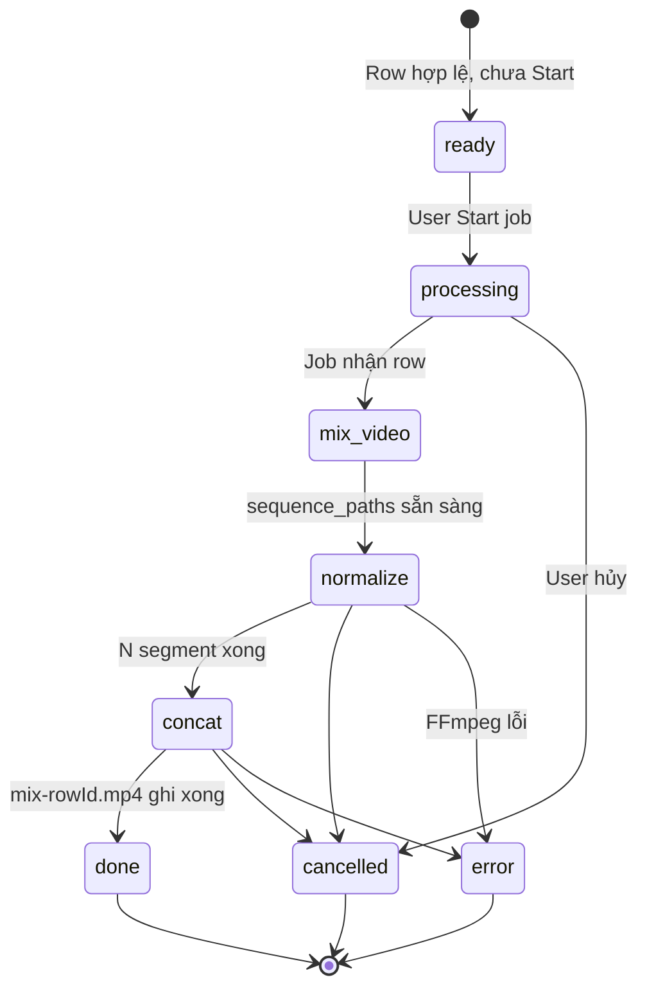
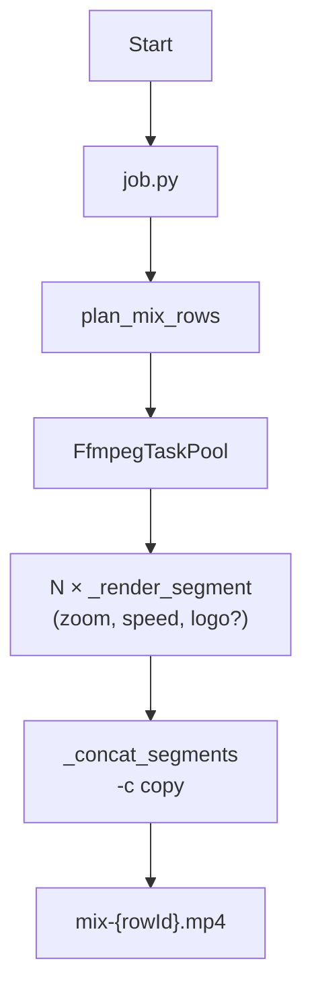
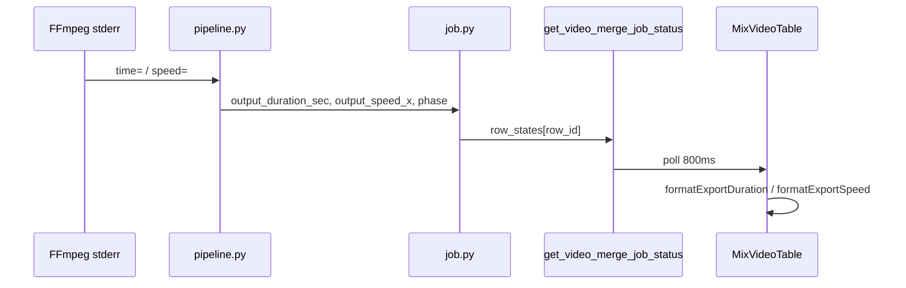

# Design: Video merge — chuẩn hóa clip (+ logo) + nối concat copy

**Date:** 2026-05-29 (rev. logo-at-normalize, RS003)  
**Prefix:** DS004  
**Status:** Revised — ready for `/plan` / implement P0–P1  
**Related:**
- `frontend/src/features/video-merge/`
- `docs/02-research/RS001-ffmpeg-python.md`
- `docs/02-research/RS003-ffmpeg-merge-speed-optimization.md`
- Legacy presets: `docs/ffmpeg.json`

---

## Summary

Mỗi mix row: **planner** chọn thứ tự clip (leading + tail) → **chuẩn hóa** từng clip (scale, fps, zoom/speed, **logo nếu bật**) → **nối** bằng **concat demuxer + `-c copy`** (cắt cứng, không xfade) → file `mix-{rowId}.{ext}`.

| Bước | FFmpeg | Encode? |
|------|--------|---------|
| Chuẩn hóa × N | `filter_complex` per clip | **Có** (1 lần / clip) |
| Nối | `-f concat -safe 0 -c copy` | **Không** (copy stream) |

**Quyết định thiết kế (2026-05-29):** Logo **không** gắn lúc nối. Gắn **trên mỗi clip** trong bước chuẩn hóa → watermark phủ **suốt** video mix; nối luôn copy → tránh encode lại cả timeline (bottleneck cũ khi có logo).

**Encoder:** libx264 (CPU) hoặc h264_nvenc (GPU nếu có CUDA); segment preset ưu tiên tốc độ (`veryfast`), concat không encode.

---

## State machine (mỗi mix row)

Luồng trạng thái UI ↔ backend (`ROW_PHASE_*` trong `pipeline.py`, `mix-row-pipeline-phase.ts`):



| Phase UI (VN) | `phase` (bridge) | Việc làm | FFmpeg |
|---------------|------------------|----------|--------|
| **Sẵn sàng** | `""` / pending | Validation FE; chưa job | — |
| **Đang xử lý** | `processing` | Row vào queue / worker | — |
| **Mix video** | `mix_video` | Planner đã có `sequence_paths`; gán zoom/speed | — |
| **Chuẩn hóa** | `normalize` | Render `seg_*.mp4` (zoom, speed, scale, fps, **logo**) | N × encode |
| **Nối video** | `concat` | Ghép segment → output | 1 × **copy** |
| Xong | — | `status=done` | — |

**Ghi chú:** Phase “Nối video (thêm logo)” trên UI **đổi label** thành **“Nối video”** — logo đã xử lý ở chuẩn hóa.

---

## Luồng pipeline (một hình)



**Mỗi row:** plan → N lần `clip_render` (**song song** theo `concurrency` qua `FfmpegTaskPool`) → 1 lần `join_concat` (**copy only**) → xóa segment tạm.

**Song song job:** nhiều **row mix** chạy song song (`ThreadPoolExecutor` trong `job.py`, `workers = concurrency`).

---

## Frontend (không đổi contract)

- `startVideoMergeJob(inputFolder, outputFolder, mix_rows, export_settings)`
- Poll status 800ms; output `mix-{rowId}.{format}`
- Config UI giữ nguyên; backend **bỏ qua** `sceneTransition` / transition duration trong v1 (concat cứng).
- Preview: `canPreviewMixRow` khi `row_states.status === "done"` hoặc `outputs[].ok && path` (`mix-output-path.ts`).

---

## Bảng Mix Video — cột & parse value

UI: `frontend/src/features/video-merge/mix-video-table.tsx` (panel `MixVideoPanel`).

Backend **không render bảng** — chỉ cung cấp số/message qua `get_video_merge_job_status` → `row_states` + `outputs`. FE format hiển thị (`format-duration.ts`).

### Ánh xạ cột

| Cột | Nguồn dữ liệu | Ai parse / format |
|-----|----------------|-------------------|
| **#** | Index FE (`index + 1`) | — |
| **Tên mix** | `Mix #{index + 1}` | FE |
| **Số video** | `len(row.leading_paths)` | FE (số leading; tail do planner, không hiện ở cột này) |
| **Tập tin (đầu tiên)** | Tên file từ `leading_paths` + `videos[]` | FE (`formatLeadingFileNames`) |
| **Tổng (đầu)** | `sum(duration_sec)` của clip leading | FE (`sumLeadingDuration`); `duration_sec` từ `io.enrich_videos_with_duration` |
| **Xuất** | Thời lượng file đầu ra / encode live | **BE parse log** → `output_duration_sec`; FE `formatExportDuration` |
| **Speed** | `speed=…x` từ stderr FFmpeg | **BE parse log** → `output_speed_x`; FE `formatExportSpeed` |
| **Trạng thái** | `row_states[row_id]` + validation FE | FE (`resolveMixRowDisplay`); BE set `status` + `message` + `phase` |
| **Thao tác** | `outputs[].path`, `outputFolder` | FE preview (`openMediaFile`) |

### Parse value bắt buộc (backend — trong `pipeline.py`)

Khi chạy `clip_render` / `join`, mỗi lần có stderr progress, cập nhật `row_states[row_id]`:

| Field bridge | Parser | Nguồn FFmpeg stderr |
|--------------|--------|---------------------|
| `output_duration_sec` | `_parse_duration_from_log(log)` | Dòng `time=HH:MM:SS.xx` (max trong chunk gần nhất) |
| `output_speed_x` | `_parse_speed_from_log(log)` | `speed=([\d.]+)x` (lần cuối trong chunk) |
| `phase` | Hằng `ROW_PHASE_*` | `processing` / `mix_video` / `normalize` / `concat` |

**Ưu tiên:** FE đọc field số trước; chỉ fallback regex trên `message` nếu field thiếu (giữ tương thích).

### `row_states` & `message` (mẫu cho cột Trạng thái)

Cập nhật qua `job._update_row_state` mỗi clip / bước join:

| Phase | `status` | `phase` | `message` (gợi ý) | Cột bảng |
|-------|----------|---------|-------------------|----------|
| Chờ job | `pending` | `""` | `""` | Sẵn sàng |
| Vào queue | `running` | `processing` | `Đang xử lý…` | Đang xử lý |
| Planner | `running` | `mix_video` | `Mix video` | Mix video |
| Clip *i*/*n* | `running` | `normalize` | `Chuẩn hóa · Clip {i}/{n}: {basename} · {speed}x · {mm:ss}` | Xuất/Speed live |
| Join | `running` | `concat` | `Nối video · {speed}x · {mm:ss}` | Xuất/Speed live |
| Xong row | `done` | `concat` | `Thời lượng xuất (FFmpeg): {sec}s · speed {x}x` | Xong |
| Lỗi | `error` | — | Text lỗi tiếng Việt | Lỗi |
| Hủy | `cancelled` | — | `Đã hủy` | Đã hủy |

**Clip index:** `i` = 1..`len(sequence_paths)` sau planner (không chỉ leading).

Khi row `done`, set cùng lúc:

- `outputs[]`: `{ row_id, ok: true, path, output_duration_sec, output_speed_x }` (probe file đầu ra bằng `ffprobe` nếu log thiếu).
- `row_states`: fields số **và** `message` có chuỗi `Thời lượng xuất (FFmpeg): …` để FE fallback khớp regex.

### Luồng parse vào bảng



---

## Pipeline (`pipeline.py`)

Gồm planner + chuẩn hóa + nối + FFmpeg helper.

### Planner

- Leading: 1–5 clip user chọn.
- Tail: thêm clip từ thư mục → gần `durationMin`–`durationMax`.
- Hàm public: `plan_mix_rows(...)` → `sequence_paths[]`.

### Chuẩn hóa từng clip (`_render_segment`)

**Video filter chain (cơ bản):**

```text
setpts=PTS-STARTPTS
→ scale (zoom factor → even W×H)
→ [fps=N nếu source chưa khớp export]
→ setpts=PTS/{speed}
→ format=yuv420p
→ [overlay logo nếu logoPath hợp lệ]
```

**Audio:**

```text
atrim (theo speed) → atempo → asetpts
```

**Logo (khi `logoPath` tồn tại):**

- Input thêm: `-i {logoPath}` (PNG).
- Overlay sau chuẩn hóa video, **trước** encode:

```text
[0:v]{vfilter}[vnorm];
[1:v]format=rgba[logo];
[vnorm][logo]overlay={position}[vout]
```

- Vị trí: map `logoPosition` → `_LOGO_OVERLAY` (9 vị trí, giữ như hiện tại).
- **Mọi clip** trong `sequence_paths` đều gắn logo → sau concat copy, watermark hiển thị **xuyên suốt** timeline.
- Legacy tham khảo: `overlay` / `scale2ref` trong cùng graph (`docs/ffmpeg.json`, ~566 preset).

**Encoder segment (mục tiêu sau RS003):**

```text
# CPU (mặc định segment — ưu tiên tốc độ)
-c:v libx264 -preset veryfast -crf 23 -pix_fmt yuv420p -threads 0

# GPU (nếu NVENC usable)
-c:v h264_nvenc -preset p5 -pix_fmt yuv420p -rc vbr -cq 23
```

Segment đã encode; chất lượng cuối chịu ảnh hưởng segment preset — concat copy **không** làm giảm thêm.

**Hàm:** `_build_video_filter_chain`, `_render_segment(..., logo_path, logo_position)`.

### Nối (`_concat_segments`)

**Luôn copy** (có hoặc không logo — logo đã burn-in ở segment):

```text
ffmpeg -y -f concat -safe 0 -i concat_list.txt -c copy mix-{id}.mp4
```

- Không input logo thứ hai ở bước nối.
- Không re-encode NVENC/x264 ở join.
- Yêu cầu: mọi `seg_*.mp4` cùng codec, resolution, fps, pix_fmt (đảm bảo bởi `_render_segment` + `ExportRenderConfig`).

**Hàm public:** `render_mix_row(...)` — plan → N segment (pool) → concat copy → metrics.

---

## Job (`job.py`)

| Việc | Cách |
|------|------|
| Thứ tự row | Song song (`ThreadPoolExecutor`, `workers = concurrency`) |
| Clip trong row | **`FfmpegTaskPool`** — `max_workers = concurrency`; mỗi clip = `SegmentRenderTask` |
| `progress` / `total` | `total` = tổng số clip; `progress` = clip render xong |
| Temp | `{plugins_parent}/temp/{job_id}/row_{id}/seg_*.mp4` — xóa sau row xong |
| Lỗi 1 row | Row `error`, row khác tiếp tục; job `done` nếu ≥1 row ok |
| Cancel | Kill FFmpeg + `cancelled` |
| Bảng Mix | stderr progress → `output_duration_sec` / `output_speed_x` / `phase` |

**Gap implement (từ RS003):** `FfmpegTaskPool` đã có + test; `render_mix_row` hiện vẫn loop tuần tự — **bắt buộc** chuyển sang pool theo design này.

---

## Module layout

```
python/services/video_merge/
  __init__.py
  io.py            # bridge + parse export settings
  pipeline.py      # planner + render + concat + ffmpeg
  ffmpeg_pool.py   # FfmpegTaskPool + SegmentRenderTask
  job.py           # job state + cancel + start/status
```

| File | Nội dung |
|------|----------|
| **`io.py`** | `list_videos_in_folder`, `enrich_videos_with_duration`, `parse_export_settings` |
| **`pipeline.py`** | `plan_mix_rows`, `render_mix_row`, `_render_segment` (+ logo), `_concat_segments` (copy only), log parsers |
| **`ffmpeg_pool.py`** | Song song segment trong row |
| **`job.py`** | Job lifecycle, `row_states`, `outputs` |

---

## So sánh thiết kế cũ → mới (logo)

| | Design cũ (trước 2026-05-29) | Design mới |
|---|------------------------------|------------|
| Logo | Concat: overlay + **re-encode** full timeline | Normalize: overlay **per clip** |
| Concat có logo | libx264/NVENC encode | **`-c copy`** |
| Số lần encode video | N + 1 (full T) | **N** |
| Phase UI join | “Nối video (thêm logo)” | “Nối video” |

Chi tiết benchmark & legacy: `docs/02-research/RS003-ffmpeg-merge-speed-optimization.md`.

---

## Test

| Test | Cover |
|------|--------|
| `test_video_merge_io.py` | parse export settings, list/probe |
| `test_video_merge_pipeline.py` | planner, segment filter **+ logo overlay argv**, concat **copy only**, parse log |
| `test_video_merge_job.py` | progress, cancel, `row_states` + `phase` |
| `test_ffmpeg_pool.py` | parallel segment order |

**Regression bắt buộc khi implement logo-at-normalize:**

- `_render_segment` với `logo_path`: cmd có 2 input + `overlay=` trong `filter_complex`.
- `_concat_segments` với `logo_path`: cmd vẫn chỉ `-c copy`, **không** `-i logo`.

---

## Thứ tự implement (P0 → P1)

1. **P1 — Logo at normalize:** `_render_segment` + logo overlay; `_concat_segments` luôn copy; cập nhật test + label UI phase.
2. **P0 — Parallel clips:** `render_mix_row` → `FfmpegTaskPool.render_segments`.
3. **P0 — Segment preset:** `veryfast` / `-threads 0` (tùy chọn setting sau).
4. Smoke: Start → 6 mix → preview `mix-*.mp4` hiển thị logo + file tồn tại.

---

## v2 (không làm now)

- xfade / `sceneTransition` từ UI
- Segment preset “Draft” vs “Final” (veryfast vs fast/crf20)
- `-hwaccel cuda` trên pipeline NVENC
- Transition duration trên form
- Cột “Dự kiến tổng” từ planner

---

## Next steps

1. `/plan --detailed` tasks P1 logo + P0 pool từ design này.
2. Implement → `uv run pytest python/tests/test_video_merge_pipeline.py python/tests/test_ffmpeg_pool.py -q`
3. Manual: job 6 mix + preview trong `MixVideoTable`.
