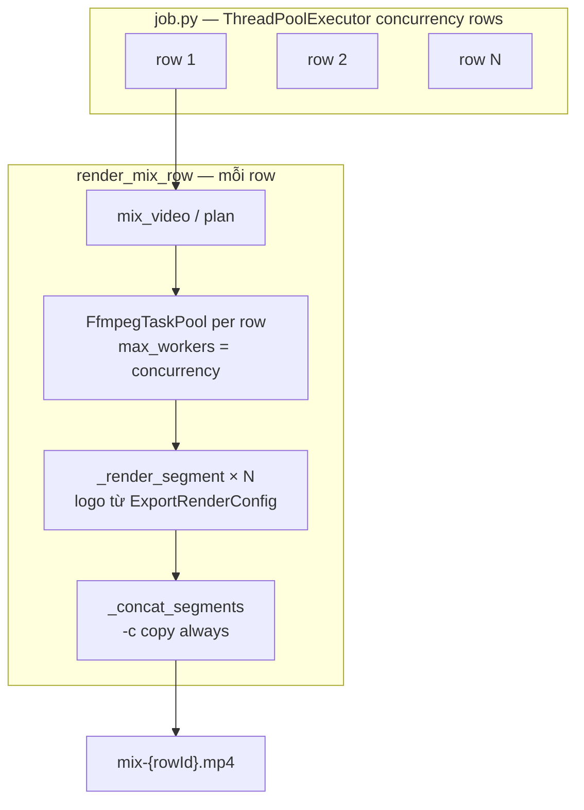
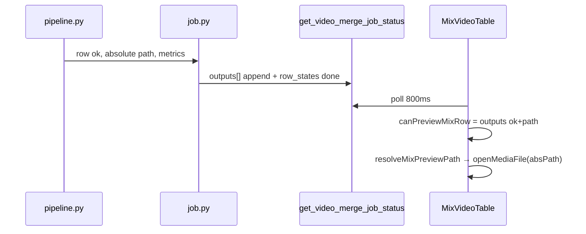
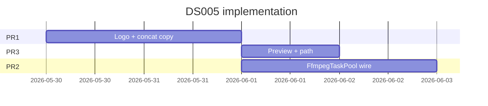

# Design: FFmpeg merge optimization MVP (RS003 brainstorm)

**Date:** 2026-05-29 (rev. post review-brainstorm)  
**Prefix:** DS005  
**Status:** Revised — ready for `/plan` + implement  
**Upstream:**
- `docs/02-research/RS003-ffmpeg-merge-speed-optimization.md`
- `docs/03-design/DS004-ffmpeg-python-video-merge.md`

**Override DS004:** Encoder segment giữ `libx264 preset=fast crf=20` / NVENC hiện tại (brainstorm Q2). DS004 gợi ý `veryfast` — **không áp dụng** trong MVP này.

---

## Summary

Một milestone gồm **3 PR** ship toàn bộ tối ưu RS003 + UX preview:

| # | Quyết định | Lựa chọn |
|---|------------|----------|
| 1 | Phạm vi | **Tất cả:** logo, pool, state machine, preview |
| 2 | Chất lượng encode | **Giữ** `fast` + CRF 20 / NVENC hiện tại |
| 3 | Concurrency | **Một knob** `concurrency` cho row pool + clip pool |
| 4 | Preview | **Per-row:** nút Xem bật khi row `done` **và** có output hợp lệ |

**Không làm trong MVP:** preset `veryfast`, hai knob concurrency, global FFmpeg cap, auto-open file, thumbnail inline.

---

## Architecture



**Encoder:** `_video_codec_args` không đổi. Tốc độ từ **bỏ re-encode join khi logo** + **song song clip**.

**Pool scope:** Mỗi row tạo **một** `FfmpegTaskPool` riêng trong `render_mix_row` (không pool job-wide). Cập nhật docstring `ffmpeg_pool.py` khi implement — hiện ghi “Job-wide” là **sai so với thiết kế**.

---

## State machine (UI ↔ backend)

Giữ `ROW_PHASE_*` như DS004.

| Phase UI | `phase` | `status` | FFmpeg |
|----------|---------|----------|--------|
| Sẵn sàng | `""` / pending | pending | — |
| Đang xử lý | `processing` | running | Queue |
| Mix video | `mix_video` | running | Planner |
| Chuẩn hóa | `normalize` | running | N × encode (+ logo) |
| Nối video | `concat` | running | 1 × copy |
| Hoàn tất | — | **done** | — |
| Lỗi | bất kỳ | **error** | — |

Label join UI: **“Nối video”** (logo đã ở chuẩn hóa).

---

## Error handling

| Scenario | Hành vi | Layer |
|----------|---------|-------|
| Logo path rỗng hoặc file không tồn tại lúc render | **Skip overlay** trên segment đó; concat vẫn copy (giống job không logo) | `_render_segment` |
| Logo mất giữa job (file bị xóa) | Clip đang chạy fail FFmpeg → row `status=error`, message stderr | row fail |
| 1 clip fail trong `FfmpegTaskPool` | **Hủy row**; không concat; temp segments cleanup trong `job.py` `finally` | PR2 |
| Concat `-c copy` fail (segment lệch codec/size/fps) | Row `error`; message FFmpeg; **không** fallback re-encode join trong MVP | `_concat_segments` |
| User hủy job | `cancel_check` → row `cancelled`; pool dừng submit clip mới | `job.py` |
| `concurrency²` quá tải CPU/RAM | Không soft-cap code; **Settings tooltip** khuyên giảm concurrency | UX copy only |
| Row `done` nhưng `ok=false` | Preview **disabled**; badge lỗi | PR3 |

**Ràng buộc concat copy:** Mọi segment phải cùng codec, resolution, fps, pixel format. Normalize + cùng `_video_codec_args` / AAC args đảm bảo điều này; logo overlay chỉ trên nhánh video, **không** đổi output size.

---

## PR breakdown

### PR1 — Logo at normalize + concat copy

**Mục tiêu:** Bỏ encode full timeline khi có logo.

| File | Thay đổi |
|------|----------|
| `pipeline.py` | `_render_segment`: đọc `config.logo_path`, `config.logo_position` từ `ExportRenderConfig` (đã có trong `io.py`); thêm `-i logo` + overlay khi file hợp lệ |
| `pipeline.py` | `_concat_segments`: **luôn** `-c copy`; **xóa** nhánh overlay+encode và params `logo_path`/`logo_position` |
| `pipeline.py` | `render_mix_row`: bỏ label “thêm logo” ở phase concat |
| `mix-row-pipeline-phase.ts` | Label join: "Nối video" |
| `test_video_merge_pipeline.py` | Segment cmd có `overlay=` khi logo; concat cmd có `-c copy`, **không** `-i` logo thứ hai |

**Logo source:** Không thêm param riêng từ `render_mix_row` — dùng `ExportRenderConfig` đã truyền vào `_render_segment`.

**Filter (segment có logo, có audio):**

```text
[0:v]{vfilter}[vnorm];[1:v]format=rgba[logo];[vnorm][logo]overlay={position}[vout]
{audio chain unchanged — setpts/atempo → [a]}
-map [vout] -map [a]  (hoặc -an nếu clip không audio)
```

**Filter (segment có logo, không audio):** chỉ nhánh video + `-an`.

**Acceptance:**
- [ ] Job có logo: concat stderr **không** có `libx264`/`nvenc` trên join
- [ ] Logo visible trên **mọi** clip trong output (spot-check 2+ segment boundaries)
- [ ] Job không logo: hành vi không đổi (copy join)
- [ ] Segment encode args identical giữa clip có/không logo (trừ filter graph)

---

### PR2 — Parallel clip pool (per row)

**Mục tiêu:** `render_mix_row` dùng `FfmpegTaskPool` thay vòng `for` tuần tự.

| File | Thay đổi |
|------|----------|
| `pipeline.py` | Build `SegmentRenderTask[]`, `with FfmpegTaskPool(export_config.concurrency)`, `render_segments` |
| `pipeline.py` | Giữ thứ tự `segment_paths` theo `clip_index` |
| `ffmpeg_pool.py` | Sửa module docstring / class doc → **per-row pool**; logo qua `export_config` (PR1) |
| `test_ffmpeg_pool.py` + `test_video_merge_pipeline.py` | Order, cancel, partial failure |

**Concurrency model:**

- Settings `concurrency` = `max_workers` row pool **và** clip pool (per row).
- Row pool: `ThreadPoolExecutor(workers=concurrency)` — hiện có (`job.py`).
- Clip pool: `FfmpegTaskPool(max_workers=concurrency)` **trong mỗi** `render_mix_row`.
- Worst case ~`concurrency²` FFmpeg processes — document trong Settings tooltip.

**Acceptance:**
- [ ] 1 row, 8 clip, concurrency=4: log ≥2 ffmpeg song song trong normalize
- [ ] Segment order trong concat list đúng sequence
- [ ] 1 clip fail → row error, không file output

---

### PR3 — Preview per-row + path contract (UX)

**Mục tiêu:** Sửa “6 mix không preview / không mở được video”; preview đúng từng row khi job còn chạy.

#### Investigation checklist (root cause — verify trước/song song fix)

| # | Giả thuyết | Cách verify | Fix nếu đúng |
|---|------------|-------------|--------------|
| H1 | `outputs[].path` **relative** (`job.py` ~304 `str(output_path)`) → `openMediaFile` fail | Poll status; so path vs `Path.resolve()` | `str(output_path.resolve())` khi `ok` |
| H2 | User chưa chọn **thư mục đầu ra** khi bấm Xem | Repro: preview without outputFolder | Toast đã có; giữ |
| H3 | User nhầm cột **Xuất/Speed** (`—`) với nút **Xem** | UX review | Cột Xuất lấy từ `row_states` live metrics (đã có) |
| H4 | `row_id` payload ≠ tên file `mix-{rowId}.mp4` | Log `row_id` vs `outputs[].row_id` vs filename | Fix planner/payload nếu lệch |
| H5 | `canPreviewMixRow` true khi `done` nhưng merge **lỗi** → mở file không tồn tại | Row error repro | Siết gate (bên dưới) |

**Hiện trạng code (đã đúng một phần):**

- `job.py`: `outputs[]` + `row_states.done` theo `as_completed`.
- Preview button **không** disabled bởi `jobActive` (`mix-video-table.tsx`).
- Poll 800ms (`use-video-merge-job.ts`).

#### Schema decision (review fix)

**Không** thêm `path` vào `VideoMergeRowJobState` — type hiện không có field đó.

Preview gate dựa **chỉ** trên:

1. `outputs[]` entry với `row_id` + `ok === true` + `path.trim().length > 0`, **hoặc**
2. Fallback `buildMixOutputFilePath(outputFolder, rowId, format)` **chỉ khi** `row_states[rowId].status === "done"` **và** có output `ok` (sau poll).

**Logic mới `canPreviewMixRow`:**

```typescript
// done alone is NOT sufficient
outputs.some(o => o.row_id === rowId && o.ok && o.path.trim())
|| (rowState === "done" && outputs.some(...)) // same ok+path check after poll
```

Đơn giản hóa thực tế: **chỉ** `outputs ok+path`, hoặc `done` **kèm** matching ok output — không enable preview trên `done` thuần.

#### Files

| File | Thay đổi |
|------|----------|
| `job.py` | `output_path`: `str(output_path.resolve())` khi `ok` |
| `mix-output-path.ts` | Siết `canPreviewMixRow`; `resolveMixPreviewPath` ưu tiên `outputs[].path` |
| `mix-output-path.test.ts` | **Breaking:** `done` without `ok` output → **false**; `done` + ok path → true |
| `mix-row-job-status.ts` | Phase labels ("Chuẩn hóa", "Nối video") |
| `types.ts` | (optional) JSDoc: preview path chỉ từ `outputs[]`, không từ `row_states` |

**Acceptance:**
- [ ] Job 6 mix: row 1 có `outputs[0].ok` → nút Xem row 1 enabled while row 2–6 `running`
- [ ] `openMediaFile` nhận **absolute** path
- [ ] Row lỗi: preview disabled; `status=error`
- [ ] Integration: `test_video_merge_job.py` — 2 rows, row1 done trước job done → status có output row1

**PR3 độc lập PR2** — có thể ship ngay sau PR1 (hoặc song song) nếu preview là pain point UX.

---

## Data flow (preview)



**Contract:** `outputs[].path` luôn absolute Windows/POSIX path khi `ok=true`.

---

## Testing matrix

| Layer | Command / case |
|-------|----------------|
| Python unit | `uv run pytest python/tests/test_video_merge_pipeline.py python/tests/test_ffmpeg_pool.py python/tests/test_video_merge_job.py -q` |
| Frontend unit | `yarn --cwd frontend test mix-output-path mix-row-pipeline-phase mix-row-job-status` |
| Integration | Multi-row job: first row `outputs` present before `status=done` job-level |
| Manual | 6 mix, logo on, concurrency=4; preview row 1 mid-job; verify logo full timeline; benchmark RS003 §4.3 |

---

## Rollout order



| Order | PR | Lý do |
|-------|-----|-------|
| 1 | PR1 | Win lớn nhất (logo); ít rủi ro |
| 2 | PR3 **hoặc** PR2 | PR3 độc lập — ưu tiên nếu bug preview cấp bách |
| 3 | PR2 | Phụ thuộc PR1 filter segment ổn định |

---

## Out of scope (v2)

- `veryfast` / Draft vs Final preset
- Global cap FFmpeg processes
- `-threads 0`
- Concat fallback re-encode khi copy fail
- Thumbnail inline trong bảng
- Single-pass multi-input `filter_complex`

---

## Open questions

Không còn blocker. PR3 hypotheses H1–H5 verify trong implement/debug — ghi evidence vào commit message hoặc test.

---

## Next steps

1. `/plan --detailed` → `docs/04-plans/FR010-ffmpeg-merge-optimization-mvp.md` (hoặc FR kế tiếp)
2. `/feature` implement PR1
3. Manual benchmark: wall-clock trước/sau (RS003 §4.3)
