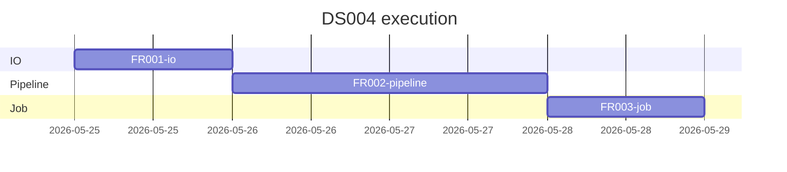
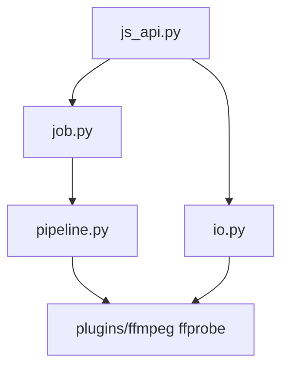

# Plan: Video merge (DS004) — ffmpeg-python hybrid

**Design:** [docs/03-design/DS004-ffmpeg-python-video-merge.md](../../03-design/DS004-ffmpeg-python-video-merge.md)  
**Plan folder:** `docs/04-plans/DS004/`  
**Modules:** 3 files — `io.py`, `pipeline.py`, `job.py`

---

## Summary

Implement desktop video merge backend: probe/list videos, plan leading+tail clips, standardize each clip (libx264), concat (+ optional logo), background job with `row_states` for Mix table columns. Replace ~15 legacy pytest files with 3 new test modules.

---

## Sub-plans (execute in order)

| Order | File | Deliverable | Est. |
|-------|------|-------------|------|
| 1 | [FR001-io.md](./FR001-io.md) | `io.py`, `test_video_merge_io.py`, `js_api` imports | ~2h |
| 2 | [FR002-pipeline.md](./FR002-pipeline.md) | `pipeline.py`, `test_video_merge_pipeline.py` | ~4h |
| 3 | [FR003-job.md](./FR003-job.md) | `job.py`, `test_video_merge_job.py`, smoke | ~3h |

---

## Architecture

---

## Shared contracts (all sub-plans)

**Bridge** (`frontend/src/lib/pywebview/types.ts` — unchanged):

- `VideoMergeJobStatusResult`: `status`, `message`, `progress`, `total`, `outputs`, `row_states`
- `VideoMergeRowJobState`: `status`, `message`, `output_duration_sec`, `output_speed_x`

**Output file:** `{outputFolder}/mix-{rowId}.{format}`

**v1:** No xfade; `sceneTransition` ignored in pipeline.

---

## Legacy cleanup (FR001 starts, FR003 finishes)

Delete after new tests pass:

`test_clip_render.py`, `test_mix_planner.py`, `test_video_merge_job.py`, `test_video_merge_concurrency.py`, `test_video_merge_runner.py`, `test_video_export_pipeline.py`, `test_pipeline_phases.py`, `test_export_settings_parse.py`, `test_ffmpeg_runner.py`, `test_ffmpeg_encode.py`, `test_ffmpeg_hw.py`, `test_ffmpeg_log_parse.py`, `test_ffmpeg_command_log.py`, `test_transition_spec.py`, `test_video_duration.py`, `test_video_folders.py`, `test_merge_cancel.py`

---

## Success criteria (release)

- [x] `uv run pytest python/tests/test_video_merge_io.py python/tests/test_video_merge_pipeline.py python/tests/test_video_merge_job.py -q` — all green
- [x] FFmpeg integration smoke (`test_video_merge_integration.py`) — `mix-*.mp4` + `row_states` (automated; desktop UI manual optional)
- [ ] Desktop UI: Video Merge page lists videos with durations (manual `make dev`)
- [ ] Desktop UI: Mix table **Xuất** / **Speed** update live during job (manual)
- [x] Cancel stops job (`test_smoke_cancel_mid_job`); partial row failure → job `done` if ≥1 row ok

---

## Next steps

1. `/execute-plan docs/04-plans/DS004/FR001-io.md`
2. `/execute-plan docs/04-plans/DS004/FR002-pipeline.md`
3. `/execute-plan docs/04-plans/DS004/FR003-job.md`
4. Optional: `/review-plan docs/04-plans/DS004/index.md`
