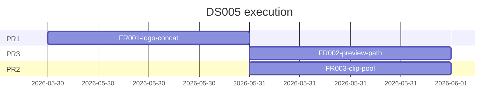

# Plan: FFmpeg merge optimization MVP (DS005)

**Design:** [docs/03-design/DS005-ffmpeg-merge-optimization-mvp.md](../../03-design/DS005-ffmpeg-merge-optimization-mvp.md)  
**Research:** [docs/02-research/RS003-ffmpeg-merge-speed-optimization.md](../../02-research/RS003-ffmpeg-merge-speed-optimization.md)  
**Plan folder:** `docs/04-plans/DS005/`

---

## Summary

Triển khai 3 PR từ DS005: (1) logo lúc normalize + concat copy, (2) preview per-row với absolute path, (3) parallel clip pool per row. Giữ encoder `fast`/CRF 20; một knob `concurrency` cho row + clip pool.

---

## Sub-plans (execute in order)

| Order | File | Deliverable | Est. | Depends on |
|-------|------|-------------|------|------------|
| 1 | [FR001-logo-concat-copy.md](./FR001-logo-concat-copy.md) | Logo in `_render_segment`; `_concat_segments` always copy | ~3h | — |
| 2 | [FR002-preview-path.md](./FR002-preview-path.md) | Absolute paths, `canPreviewMixRow` gate, phase labels | ~2h | FR001 (manual test cùng pipeline) |
| 3 | [FR003-clip-pool.md](./FR003-clip-pool.md) | `FfmpegTaskPool` in `render_mix_row`, concurrency tooltip | ~3h | FR001 |

**Note:** FR002 độc lập FR003 — có thể song song sau FR001 nếu 2 dev.



---

## Architecture

```mermaid
flowchart TB
  subgraph job [job.py]
    RowPool[ThreadPoolExecutor concurrency]
  end
  subgraph row [render_mix_row]
    Pool[FfmpegTaskPool per row]
    Seg["_render_segment + logo?"]
    Join["_concat_segments -c copy"]
  end
  UI[MixVideoTable] -->|poll 800ms| API[get_video_merge_job_status]
  job --> row
  row --> Out["mix-{rowId}.mp4 absolute path"]
  API --> UI
```



---

## Shared contracts

| Contract | Value |
|----------|--------|
| Output file | `{outputFolder}/mix-{rowId}.{ext}` |
| `outputs[].path` | Absolute path when `ok=true` (FR002) |
| Preview gate | `outputs` with `ok && path` only — not `done` alone |
| Logo | `ExportRenderConfig.logo_path` / `logo_position` in `_render_segment` |
| Concat | Always `-f concat -safe 0 -c copy` (no logo input at join) |
| Encoder | Unchanged: `_video_codec_args` / `_X264_ARGS_FAST` |

---

## Verification (release)

```bash
uv run pytest python/tests/test_video_merge_pipeline.py python/tests/test_ffmpeg_pool.py python/tests/test_video_merge_job.py -q
yarn --cwd frontend test mix-output-path mix-row-pipeline-phase mix-row-job-status
```

**Manual UAT:**

- [ ] 6 mix, logo on: preview row 1 khi row 2–6 còn chạy
- [ ] Logo visible suốt timeline (≥2 segment boundaries)
- [ ] Concat log không re-encode khi logo bật
- [ ] Benchmark wall-clock trước/sau (RS003 §4.3)

---

## Risks

| Risk | Impact | Mitigation |
|------|--------|------------|
| Segment codec mismatch → concat copy fail | High | Same `_video_codec_args` all segments; test multi-clip |
| concurrency² overload | Medium | Settings tooltip (FR003) |
| Preview relative path (H1) | Medium | `Path.resolve()` in `job.py` (FR002) |
| Pool partial failure leaves orphan segments | Low | Existing `job.py` temp cleanup in `finally` |

---

## Next steps

1. `/execute-plan docs/04-plans/DS005/FR001-logo-concat-copy.md`
2. `/execute-plan docs/04-plans/DS005/FR002-preview-path.md`
3. `/execute-plan docs/04-plans/DS005/FR003-clip-pool.md`
4. `/review-plan docs/04-plans/DS005/index.md` (optional)
